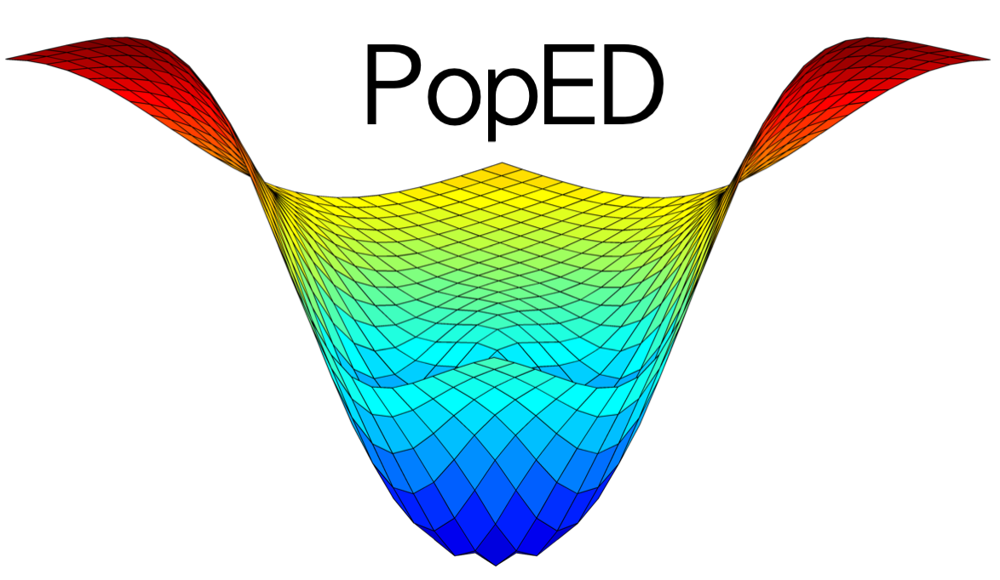

<!-- README.md is generated from README.Rmd. Please edit that file -->

# PopED 

[](https://travis-ci.org/andrewhooker/PopED)
[](https://ci.appveyor.com/project/andrewhooker/PopED)
[](https://CRAN.R-project.org/package=PopED)
[](https://codecov.io/github/andrewhooker/PopED?branch=master)

PopED computes optimal experimental designs for both population and
individual studies based on nonlinear mixed-effect models. Often this is
based on a computation of the Fisher Information Matrix (FIM).

## Installation

You need to have R installed. Download the latest version of R from
www.r-project.org. You can install the released version of PopED from
[CRAN](https://CRAN.R-project.org) with:

``` r
install.packages("PopED")
```

And the development version from [GitHub](https://github.com/) with:

``` r
# install.packages("devtools")
devtools::install_github("andrewhooker/PopED")
```

## Getting started

To get started you need to define

1.  A model.
2.  An initial design (and design space if you want to optimize).
3.  The tasks to perform.

Learn more in this [introduction to
PopED](https://andrewhooker.github.io/PopED/articles/intro-poped.html)

## Contact

You are welcome to:

  - submit suggestions and bug-reports at:
    <https://github.com/andrewhooker/PopED/issues>
  - send a pull request on: <https://github.com/andrewhooker/PopED>
  - compose a friendly e-mail to: <andrew.hooker@farmbio.uu.se>
