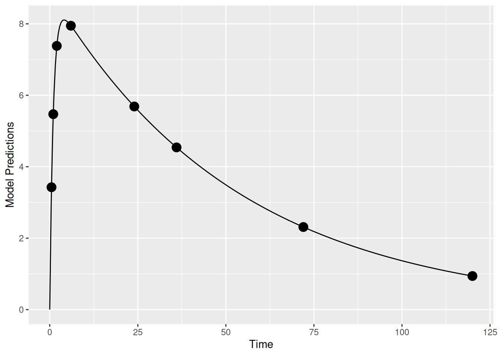
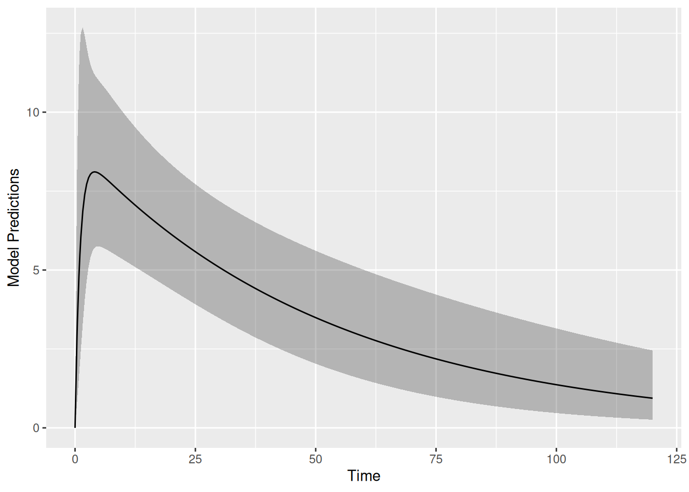
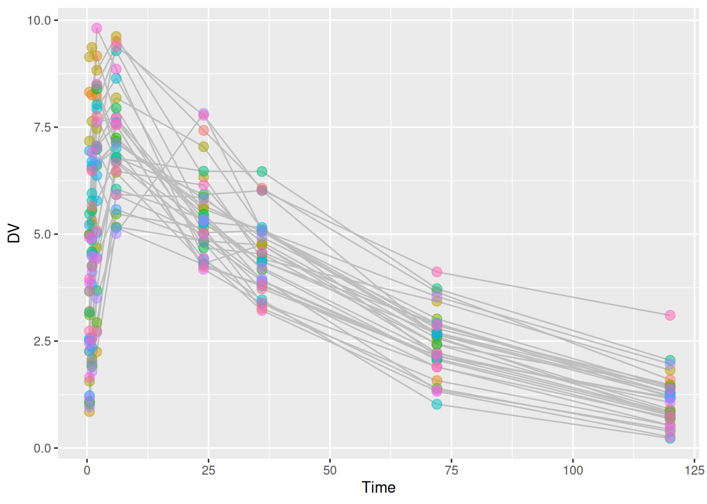
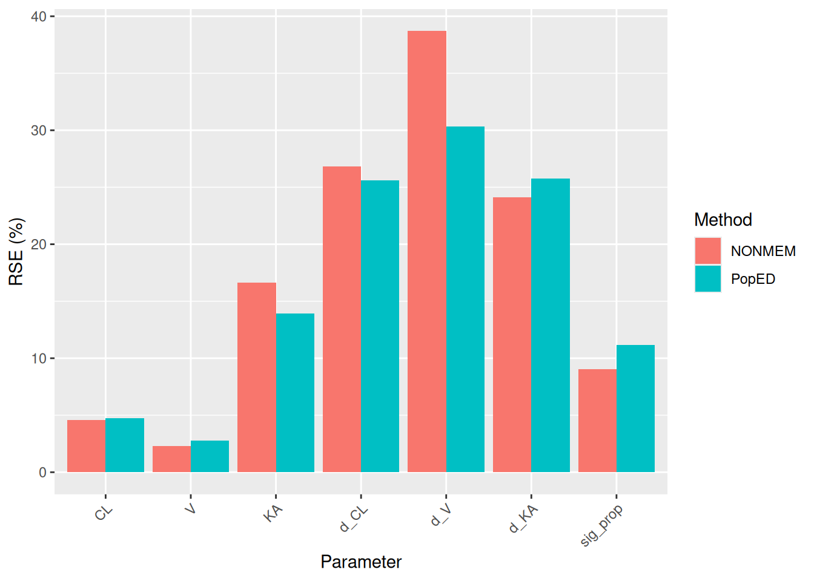

# Compare Uncertainty Predictions from PopED with NONMEM

Packages used for this vignette

``` r
library(PopED)
library(dplyr)
library(tidyr)
library(readr)
library(ggplot2)
```

## 1 Introduction

Before running a clinical study, it is useful to know how precisely the
model parameters can be estimated from the planned design. PopED answers
that question by inverting the Fisher Information Matrix (FIM) for the
design, producing predicted parameter RSE without any data. This article
checks those predictions against what NONMEM reports from `$COVARIANCE`
after fitting the same model to one simulated dataset, using the
Warfarin example from Nyberg et al.
([2015](#ref-nybergMethodsSoftwareTools2015)). We find that the two
agree closely, with PopED slightly lower, on average. This is consistent
with the FIM giving a Cramér-Rao lower bound and a single NONMEM fit
reflecting just one realization of the data.

## 2 Population models

In this work we are using population, or nonlinear mixed-effect (NLME)
models. Here we define $y_{ij}$ for the $j^{th}$ observation of the
$i^{th}$ individual in a population as:

$$y_{ij} = f(t_{ij},{\overset{\rightarrow}{a}}_{i},{\overset{\rightarrow}{\theta}}_{i}) + h(t_{ij},{\overset{\rightarrow}{a}}_{i},{\overset{\rightarrow}{\theta}}_{i},{\overset{\rightarrow}{\varepsilon}}_{ij})\qquad(1)$$

Where $t_{ij}$ are the measurement times
${\overset{\rightarrow}{a}}_{i}$ is a vector of covariates (doses of a
drug, weight, age, concentration of a drug in blood plasma, etc.),
${\overset{\rightarrow}{\theta}}_{i}$ is a vector of model parameter
values, $h(.)$ is a model for the residual error (also referred to as
residual unexplained variability, or RUV) in the model and
${\overset{\rightarrow}{\varepsilon}}_{ij}$ is a vector of random
variables describing data-level deviations from the model. Often, as is
the case in the models described here, the elements of
${\overset{\rightarrow}{\varepsilon}}_{ij}$ are assumed to come from
normal distributions with means of zero and a covariance matrix of
$\mathbf{\Sigma}$ (elements of $\sigma_{lm}^{2}$), where
$\mathbf{\Sigma}$ is typically diagonal.

Population effects are modeled on the parameter level, where individual
parameter values are derived from typical (or population) parameters
$\overset{\rightarrow}{\theta}$, individual deviations due to covariates
${\overset{\rightarrow}{a}}_{i}$, and random individual deviations
${\overset{\rightarrow}{\eta}}_{i}$ (referred to as a between-subject
variability, or BSV, term).

$${\overset{\rightarrow}{\theta}}_{i} = g(\overset{\rightarrow}{\theta},{\overset{\rightarrow}{a}}_{i},{\overset{\rightarrow}{\eta}}_{i})\qquad(2)$$

Extensions, where deviations are on other scales, are possible as well
(such as parameter deviations between occasions within an individual’s
study, center level deviations, study level deviations, etc.). Often, as
is the case in the models described here, the elements of
${\overset{\rightarrow}{\eta}}_{i}$ are assumed to come from normal
distributions with means of zero and a covariance matrix of
$\mathbf{\Omega}$ (elements of $\omega_{pq}^{2}$).

## 3 Simple Population PK model in PopED

### 3.1 Structural model

Here we define a one-compartment pharmacokinetic model with linear
absorption and a single drug dose using an analytical solution.

$$f(t_{ij},D_{i},{\overset{\rightarrow}{\theta}}_{i}) = \frac{D_{i} \cdot F \cdot Ka_{i}}{V_{i} \cdot (Ka_{i} - CL_{i}/V_{i})} \cdot (e^{-\frac{CL_{i}}{V_{i}}t_{ij}} - e^{-Ka_{i} \cdot t_{ij}})\qquad(3)$$

Where $D_{i}$ is the dose of drug given to individual $i$, $F$ is the
bioavailability, $Ka_{i}$ is the absorption rate constant for individual
$i$, $V_{i}$ is the volume of distribution for individual $i$, and
$CL_{i}$ is the clearance for individual $i$.

Defining this in PopED we have:

``` r
##-- Model: One comp first order absorption
ff <- function(model_switch,xt,parameters,poped.db){
  with(as.list(parameters),{
    y=xt
    y=(DOSE*Favail*KA/(V*(KA-CL/V)))*(exp(-CL/V*xt)-exp(-KA*xt))
    return(list(y=y,poped.db=poped.db))
  })
}
```

### 3.2 Random effects model

Taking the random effect structure and parameter values from the
Warfarin example from software comparison in Nyberg et al., “Methods and
software tools for design evaluation for population
pharmacokinetics-pharmacodynamics studies”, Br. J. Clin. Pharm., 2014
([Nyberg et al. 2015](#ref-nybergMethodsSoftwareTools2015)), we have a
proportional residual error model, with a coefficient of variation of
10%, and exponential random effects are assumed for CL, V and Ka.

$$\begin{aligned}
y_{ij} & {= f(t_{ij},D_{i},{\overset{\rightarrow}{\theta}}_{i}) \cdot (1 + {\overset{\rightarrow}{\varepsilon}}_{ij})} \\
 & \\
{CL_{i}} & {= \theta_{CL} \cdot e^{\eta_{CL,i}}} \\
V_{i} & {= \theta_{V} \cdot e^{\eta_{V,i}}} \\
{Ka_{i}} & {= \theta_{Ka} \cdot e^{\eta_{Ka,i}}} \\
\mathbf{\Omega} & {= \begin{bmatrix}
\omega_{CL}^{2} & 0 & 0 \\
0 & \omega_{V}^{2} & 0 \\
0 & 0 & \omega_{Ka}^{2}
\end{bmatrix}} \\
\mathbf{\Sigma} & {= \begin{bmatrix}
\sigma_{\text{prop}}^{2}
\end{bmatrix}}
\end{aligned}\qquad(4)$$

This is defined in PopED with the following:

``` r
## -- parameter definition function 
sfg <- function(x,a,bpop,b,bocc){
  parameters=c(CL=bpop[1]*exp(b[1]),
               V=bpop[2]*exp(b[2]),
               KA=bpop[3]*exp(b[3]),
               Favail=bpop[4],
               DOSE=a[1])
  return(parameters) 
}

## -- Residual Error function
feps <- function(model_switch,xt,parameters,epsi,poped.db){
  y <- do.call(poped.db$model$ff_pointer,list(model_switch,xt,parameters,poped.db))[[1]] 
  y = y*(1+epsi[,1])  
  return(list(y=y,poped.db=poped.db)) 
}
```

### 3.3 Parameter values and study design

We create a poped database to link the model defined above with a set of
model parameters, the initial design and a design space for
optimization.

In this example, the parameter values are defined for the fixed effects
(`bpop`), the between-subject variability variances (`d`) and the
residual variability variances (`sigma`). We also fix the parameter
`Favail` using `notfixed_bpop`, since we have only oral dosing and the
parameter is not identifiable. Fixing a parameter means that we assume
the parameter will not be estimated (and is known without uncertainty).

For the initial design, we define 1 group (`m=1`) of 32 individuals
(`groupsize=32`), with a single dose of 70 mg (`a`). The initial design
has 8 sample times per individual (`xt`).

For the design space, which can be searched during design optimization,
we define a potential dose range of between 0 and 100 mg (`mina` and
`maxa`), and a range of potential sample times between 0 and 120 hours
(`minxt` and `maxxt`).

``` r
## -- Define initial design  and design space
poped.db <- 
  create.poped.database(
    # Model
    ff_fun = ff,
    fg_fun = sfg,
    fError_fun = feps,
                                  
    # Parameters 
    bpop = c(CL=0.15, V=8, KA=1.0, Favail=1), 
    notfixed_bpop = c(1,1,1,0),
    d = c(CL=0.07, V=0.02, KA=0.6), 
    sigma = c(prop=0.01),
                                  
    # Design
    groupsize = 32,
    xt = c(0.5,1,2,6,24,36,72,120),
    a = 70,
    
    # Design space
    minxt = 0,
    maxxt = 120,
    mina = 0,
    maxa = 100)
```

### 3.4 Design simulation

First it may make sense to check your model and design to make sure you
get what you expect when simulating data. Here we plot the model typical
values:

``` r
plot_model_prediction(poped.db, model_num_points = 300)
```



Next, we plot the expected prediction interval (by default a 95% PI) of
the data taking into account the BSV and RUV using the option `PI=TRUE`.
This option makes predictions based on first-order approximations to the
model variance and a normality assumption of that variance. Better (and
slower) computations are possible with the `DV=T`, `IPRED=T` and
`groupsize_sim = some large number` options.

``` r
plot_model_prediction(poped.db, 
                      PI=TRUE, 
                      model_num_points = 300, 
                      sample.times = FALSE)
```



We can get these predictions numerically as well:

``` r
dat <- model_prediction(poped.db,DV=TRUE)
head(dat,n=8);tail(dat,n=8)
```

``` output
  ID  Time        DV     IPRED      PRED Group Model a_i
1  1   0.5 4.3470706 4.4871432 3.4254357     1     1  70
2  1   1.0 6.9354158 6.5381440 5.4711041     1     1  70
3  1   2.0 7.2289142 7.8255245 7.3821834     1     1  70
4  1   6.0 7.8433729 7.5230426 7.9462805     1     1  70
5  1  24.0 4.7704277 4.9963083 5.6858561     1     1  70
6  1  36.0 3.3831460 3.8029098 4.5402483     1     1  70
7  1  72.0 1.8834851 1.6769357 2.3116966     1     1  70
8  1 120.0 0.6216558 0.5628382 0.9398657     1     1  70
```

``` output
    ID  Time        DV    IPRED      PRED Group Model a_i
249 32   0.5 10.332921 8.487080 3.4254357     1     1  70
250 32   1.0  9.387750 8.477020 5.4711041     1     1  70
251 32   2.0  7.347085 8.361443 7.3821834     1     1  70
252 32   6.0  8.882205 7.913646 7.9462805     1     1  70
253 32  24.0  6.257901 6.177403 5.6858561     1     1  70
254 32  36.0  5.717171 5.237116 4.5402483     1     1  70
255 32  72.0  2.769390 3.191176 2.3116966     1     1  70
256 32 120.0  1.634981 1.648525 0.9398657     1     1  70
```

### 3.5 Design evaluation

Next, we evaluate the initial design

``` r
(ds1 <- evaluate_design(poped.db))
```

``` output
$ofv
[1] 52.44799

$fim
                  CL          V        KA         d_CL          d_V        d_KA
CL       19821.28445 -21.836551 -8.622140 0.000000e+00     0.000000  0.00000000
V          -21.83655  20.656071 -1.807099 0.000000e+00     0.000000  0.00000000
KA          -8.62214  -1.807099 51.729039 0.000000e+00     0.000000  0.00000000
d_CL         0.00000   0.000000  0.000000 3.107768e+03    10.728786  0.02613561
d_V          0.00000   0.000000  0.000000 1.072879e+01 27307.089308  3.26560786
d_KA         0.00000   0.000000  0.000000 2.613561e-02     3.265608 41.81083599
sig_prop     0.00000   0.000000  0.000000 5.215403e+02 11214.210707 71.08763902
             sig_prop
CL            0.00000
V             0.00000
KA            0.00000
d_CL        521.54030
d_V       11214.21071
d_KA         71.08764
sig_prop 806176.95068

$rse
       CL         V        KA      d_CL       d_V      d_KA  sig_prop
 4.738266  2.756206 13.925829 25.627205 30.344316 25.777327 11.170784 
```

We see that all parameters relative standard errors (rse above) in % are
predicted to be relatively well estimated.

## 4 Evaluation of design in NONMEM

### 4.1 Create dataset

Now we create a dataset simulated from this model and design. File paths
below are relative to the directory containing this `.qmd` file.

``` r
set.seed(12398)
dosing_1 <- list(list(AMT=70,Time=0))
dat <- model_prediction(poped.db, dosing = dosing_1, DV=T,filename = "./compare_poped_with_nonmem_data/temp.csv") |>
  dplyr::select(-c(IPRED,PRED))
readr::write_csv(dat,file = "./compare_poped_with_nonmem_data/warfarin.csv",na = ".")
```

The simulated data look like this:

``` r
head(dat,20)
```

``` output
   ID  Time       DV AMT Group Model a_i
1   1   0.0       NA  70     1     1  70
2   1   0.5 3.198757  NA     1     1  70
3   1   1.0 5.319627  NA     1     1  70
4   1   2.0 6.977056  NA     1     1  70
5   1   6.0 9.502303  NA     1     1  70
6   1  24.0 7.424704  NA     1     1  70
7   1  36.0 6.072961  NA     1     1  70
8   1  72.0 3.646986  NA     1     1  70
9   1 120.0 1.595916  NA     1     1  70
10  2   0.0       NA  70     1     1  70
11  2   0.5 4.997493  NA     1     1  70
12  2   1.0 6.519595  NA     1     1  70
13  2   2.0 8.211107  NA     1     1  70
14  2   6.0 7.138961  NA     1     1  70
15  2  24.0 5.664554  NA     1     1  70
16  2  36.0 5.059473  NA     1     1  70
17  2  72.0 2.647690  NA     1     1  70
18  2 120.0 1.227866  NA     1     1  70
19  3   0.0       NA  70     1     1  70
20  3   0.5 8.317745  NA     1     1  70
```

``` r
p <- ggplot(dat,aes(x=Time,y=DV,group=ID)) +
    geom_line(color="grey") +
    geom_point(size=3,alpha=0.5,
               aes(colour = ID) ) +
  theme(legend.position = "none")
p
```



### 4.2 NONMEM evaluation

We create a NONMEM model file.

``` r
nm_mod <- paste(
"$PROBLEM
$INPUT ID TIME DV AMT GROUP MODEL DOSE
$DATA ../compare_poped_with_nonmem_data/warfarin.csv IGNORE=@
$SUBROUTINES ADVAN2  TRANS2 
$PK
  CL = THETA(1) * EXP(ETA(1))
  VC = THETA(2) * EXP(ETA(2))
  KA = THETA(3) * EXP(ETA(3))
  V = VC

$ERROR
  CONC = A(2)/VC
  Y = CONC + CONC * EPS(1)

$ESTIMATION METHOD=COND INTERACTION MAXEVAL=9999 POSTHOC 
$COVARIANCE

$THETA (0, 0.15) ; POP_CL
$THETA (0, 8) ; POP_VC
$THETA (0, 1) ; POP_KA

$OMEGA 0.07 ; IIV_CL
$OMEGA 0.02 ; IIV_VC
$OMEGA 0.6 ; IIV_KA

$SIGMA 0.01; RUV_PROP

$TABLE ID VC CL KA ETA(1) ETA(2) ETA(3) FILE=sdtab1 NOAPPEND NOPRINT
") 
write_file(nm_mod,file="./compare_poped_with_nonmem_models/run1.mod")
```

> **How to reproduce the NONMEM run**
>
> The NONMEM output files needed below (`run1.ext`, etc.) are
> precomputed and shipped with this article in the PopED GitHub
> repository under
> `vignettes/articles/compare_poped_with_nonmem_models/`, so rendering
> this document does not require a NONMEM installation.
>
> To regenerate them yourself, run the following from the article
> directory (`vignettes/articles/`) using
> [PsN](https://uupharmacometrics.github.io/PsN/) and a working NONMEM
> installation:
>
> ``` bash
> # Estimate the model
> execute ./compare_poped_with_nonmem_models/run1.mod
>
> # Optional: print a parameter-estimate summary
> sumo ./compare_poped_with_nonmem_models/run1.lst
> ```
>
> After `execute` completes, `run1.ext` will be available alongside
> `run1.mod` and the rest of the chunks below can be re-rendered without
> changes.

We define a small helper that extracts parameter RSE (%) from a NONMEM
`.ext` file.

``` r
nonmem_rse <- function(ext_file) {
  ext <- read_table(ext_file, skip = 1, show_col_types = FALSE)
  est <- ext |> filter(ITERATION == -1000000000) |> select(-ITERATION, -OBJ)
  se  <- ext |> filter(ITERATION == -1000000001) |> select(-ITERATION, -OBJ)
  rse <- abs(se) / abs(est) * 100
  rse[, unlist(se) != 0, drop = FALSE]
  rse[, unlist(est) != 0, drop = FALSE]
}

par_rse_nonmem <- nonmem_rse("./compare_poped_with_nonmem_models/run1.ext") |>
  rename(
    CL           = THETA1,
    V            = THETA2,
    KA           = THETA3,
    d_CL         = `OMEGA(1,1)`,
    d_V          = `OMEGA(2,2)`,
    d_KA         = `OMEGA(3,3)`,
    `sig_prop`   = `SIGMA(1,1)`
  ) |>
  relocate(`sig_prop`, .after = last_col())

round(par_rse_nonmem, 2)
```

``` output
    CL    V    KA  d_CL   d_V  d_KA sig_prop
1 4.58 2.28 16.63 26.81 38.72 24.14     9.02
```

## 5 Compare PopED and NONMEM

We can compare between the prediction in PopED and the covariance matrix
in NONMEM.

``` r
result <- rbind(par_rse_nonmem,ds1$rse)|>
  mutate("Method"=c("NONMEM","PopED"),.before=CL)

result_table <- result |> 
  pivot_longer(-Method, names_to = "Parameter", values_to = "RSE") |>
  pivot_wider(names_from = Method, values_from = RSE) 
knitr::kable(result_table, digits = 2, 
             caption = "Predicted parameter RSE (%) from NONMEM and PopED.") 
```

| Parameter | NONMEM | PopED |
|:----------|-------:|------:|
| CL        |   4.58 |  4.74 |
| V         |   2.28 |  2.76 |
| KA        |  16.63 | 13.93 |
| d_CL      |  26.81 | 25.63 |
| d_V       |  38.72 | 30.34 |
| d_KA      |  24.14 | 25.78 |
| sig_prop  |   9.02 | 11.17 |

Predicted parameter RSE (%) from NONMEM and PopED.

``` r
result |>
  pivot_longer(-Method,names_to = "Parameter",values_to = "RSE") |>
  ggplot(aes(x=Parameter,y=RSE,fill=Method)) +
  geom_col(position = position_dodge()) +
  labs(y = "RSE (%)") +
  theme(axis.text.x = element_text(angle = 45, hjust = 1)) +
  scale_x_discrete(limits = names(result[-1]))
```



## 6 Conclusions

The NONMEM and PopED results are similar, though they differ in how they
are obtained:

- **NONMEM** estimates RSE from the covariance matrix produced by
  `$COVARIANCE` after fitting the model to a *single* simulated dataset.
  The values therefore reflect the variability of one particular
  realization of the data.
- **PopED** computes RSE by inverting the Fisher Information Matrix
  evaluated from the design and assumed model and parameter values. The
  RSE values therefore reflect the *expected* uncertainty across all
  realizations of the data, before any data are collected.
- Because the FIM gives the **Cramér-Rao lower bound** on the variance
  of any unbiased estimator, PopED’s RSE values are expected to be
  smaller on average than NONMEM’s. This is consistent with what we
  observe here.
- A more directly comparable check would be a **stochastic simulation
  and estimation (SSE)** study in NONMEM — many simulated datasets, each
  fit with the same model — which averages out the single-realization
  noise. This comparison was carried out in Nyberg et al.
  ([2015](#ref-nybergMethodsSoftwareTools2015)).

In short: for the planning stage, the FIM-based predictions from PopED
are a fast and reliable substitute for the much more expensive
simulate-and-estimate workflow, with the expectation that they will be
slightly optimistic relative to a single NONMEM run.

## Session info

Session info

``` r
sessionInfo()
```

``` output
R version 4.6.0 (2026-04-24)
Platform: x86_64-pc-linux-gnu
Running under: Ubuntu 24.04.4 LTS

Matrix products: default
BLAS:   /usr/lib/x86_64-linux-gnu/openblas-pthread/libblas.so.3
LAPACK: /usr/lib/x86_64-linux-gnu/openblas-pthread/libopenblasp-r0.3.26.so;  LAPACK version 3.12.0

locale:
 [1] LC_CTYPE=C.UTF-8       LC_NUMERIC=C           LC_TIME=C.UTF-8
 [4] LC_COLLATE=C.UTF-8     LC_MONETARY=C.UTF-8    LC_MESSAGES=C.UTF-8
 [7] LC_PAPER=C.UTF-8       LC_NAME=C              LC_ADDRESS=C
[10] LC_TELEPHONE=C         LC_MEASUREMENT=C.UTF-8 LC_IDENTIFICATION=C

time zone: UTC
tzcode source: system (glibc)

attached base packages:
[1] stats     graphics  grDevices utils     datasets  methods   base

other attached packages:
[1] ggplot2_4.0.3    readr_2.2.0      tidyr_1.3.2      dplyr_1.2.1
[5] PopED_0.7.0.9001

loaded via a namespace (and not attached):
 [1] bit_4.6.0          gtable_0.3.6       jsonlite_2.0.0     crayon_1.5.3
 [5] compiler_4.6.0     tidyselect_1.2.1   parallel_4.6.0     scales_1.4.0
 [9] yaml_2.3.12        fastmap_1.2.0      R6_2.6.1           labeling_0.4.3
[13] generics_0.1.4     knitr_1.51         tibble_3.3.1       pillar_1.11.1
[17] RColorBrewer_1.1-3 tzdb_0.5.0         rlang_1.2.0        xfun_0.57
[21] S7_0.2.2           bit64_4.8.0        otel_0.2.0         cli_3.6.6
[25] withr_3.0.2        magrittr_2.0.5     digest_0.6.39      grid_4.6.0
[29] vroom_1.7.1        mvtnorm_1.3-7      hms_1.1.4          lifecycle_1.0.5
[33] vctrs_0.7.3        evaluate_1.0.5     glue_1.8.1         farver_2.1.2
[37] codetools_0.2-20   rmarkdown_2.31     purrr_1.2.2        tools_4.6.0
[41] pkgconfig_2.0.3    htmltools_0.5.9   
```

## References

Nyberg, Joakim, Caroline Bazzoli, Kay Ogungbenro, et al. 2015. “Methods
and Software Tools for Design Evaluation in Population
Pharmacokinetics-Pharmacodynamics Studies.” *British Journal of Clinical
Pharmacology* 79 (1): 6–17. <https://doi.org/10.1111/bcp.12352>.
