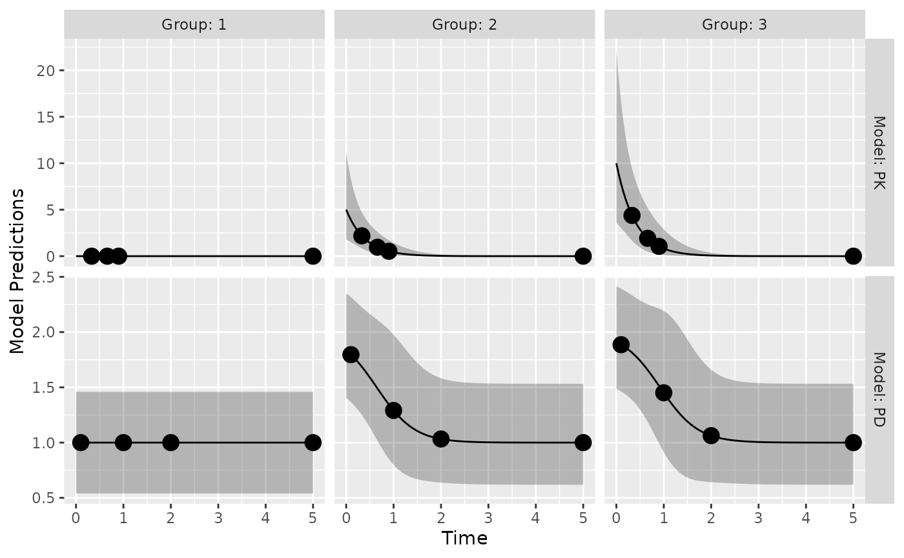
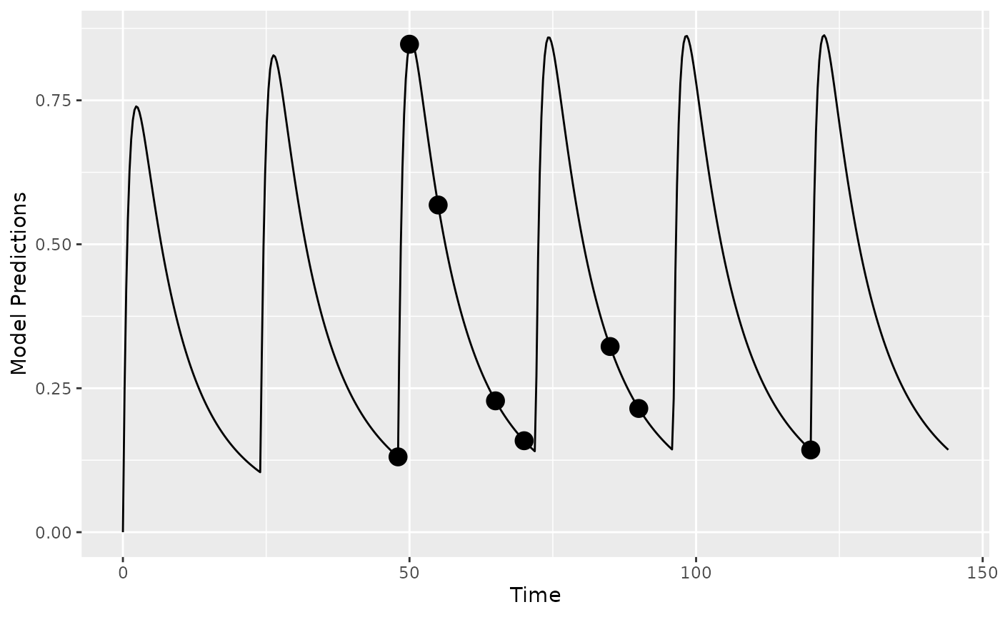
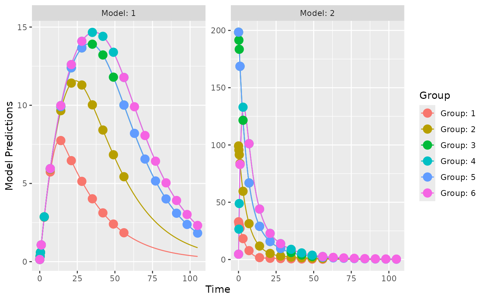
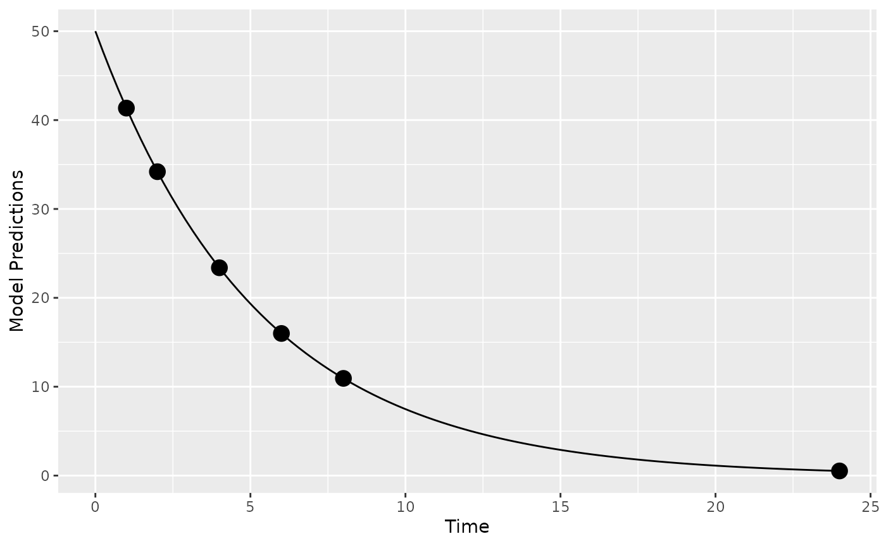
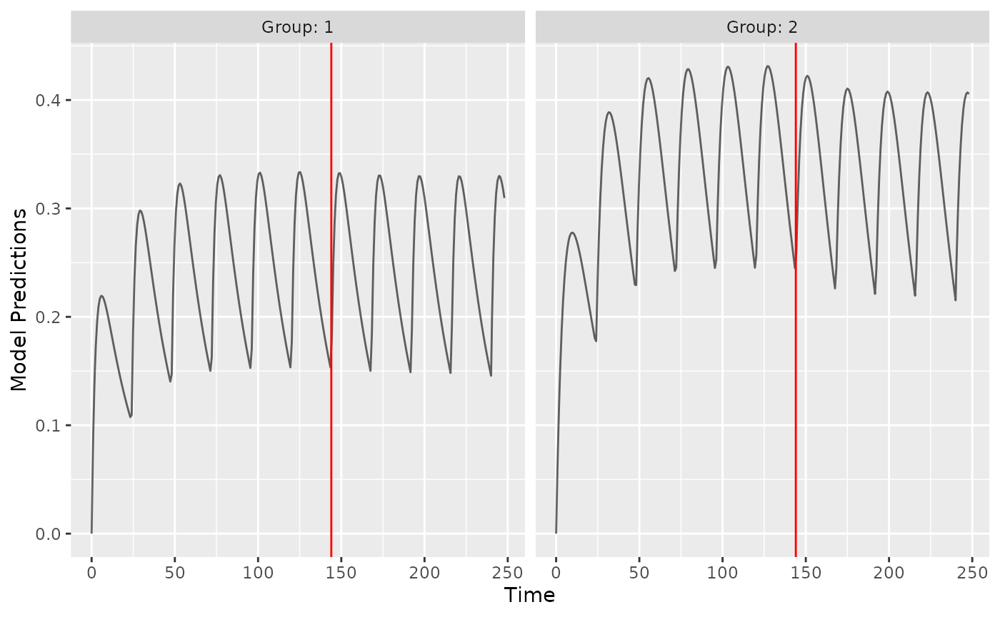
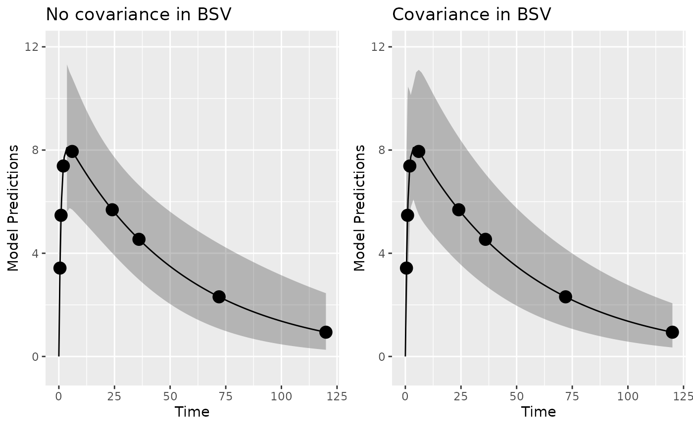
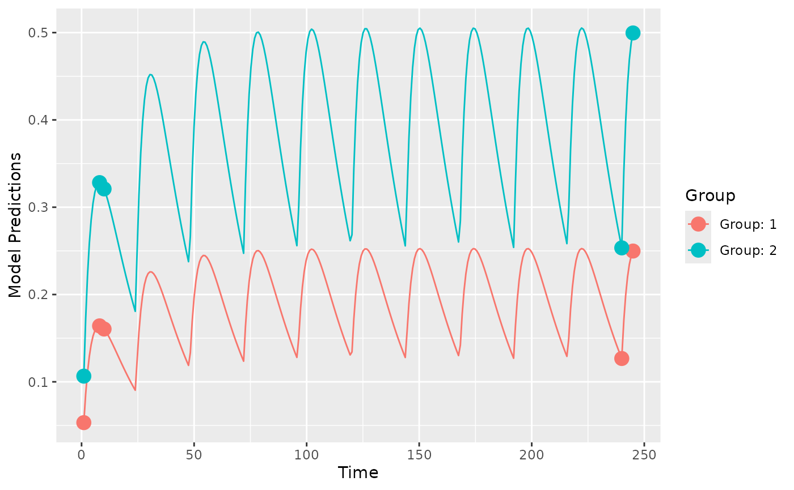
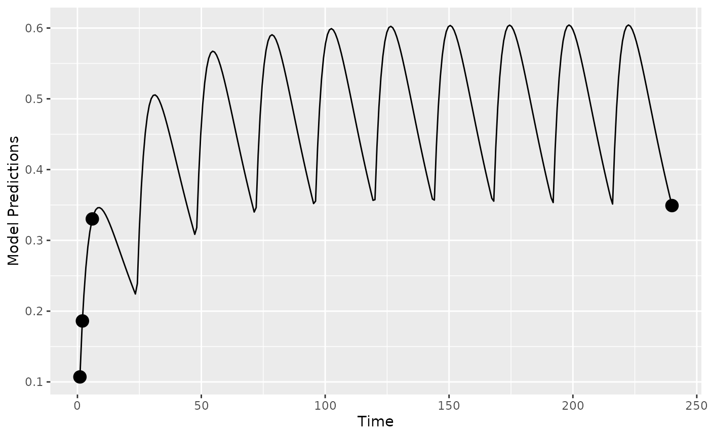
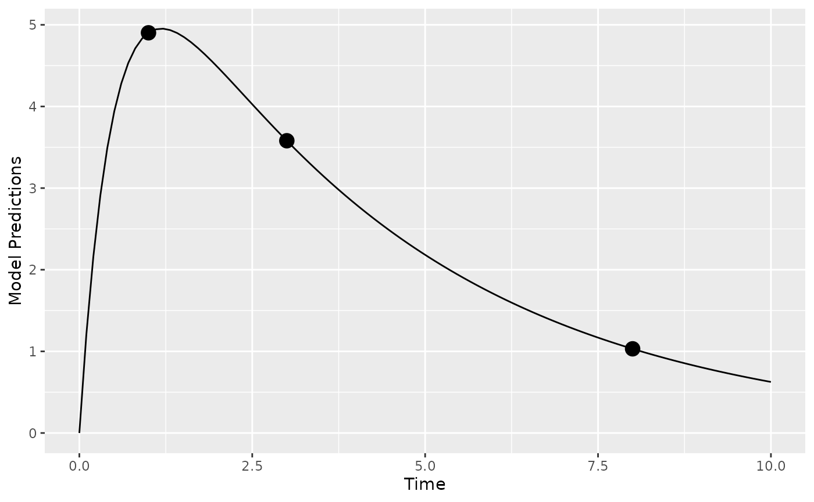

# Examples

## Introduction

In this vignette, we try to highlight PopED features that may be useful.
Only code related to specific features we would like to highlight is
described here in this vignette. These features (and more) are presented
as r-scripts in the “examples” folder in the PopED installation
directory. You can view a list of these example files using the
commands:

``` r
ex_dir <- system.file("examples", package="PopED")
list.files(ex_dir)
#>  [1] "ex.1.a.PK.1.comp.oral.md.intro.R"          
#>  [2] "ex.1.b.PK.1.comp.oral.md.re-parameterize.R"
#>  [3] "ex.1.c.PK.1.comp.oral.md.ODE.compiled.R"   
#>  [4] "ex.10.PKPD.HCV.compiled.R"                 
#>  [5] "ex.11.PK.prior.R"                          
#>  [6] "ex.12.covariate.distributions.R"           
#>  [7] "ex.13.shrinkage.R"                         
#>  [8] "ex.14.PK.IOV.R"                            
#>  [9] "ex.15.full.covariance.matrix.R"            
#> [10] "ex.2.a.warfarin.evaluate.R"                
#> [11] "ex.2.b.warfarin.optimize.R"                
#> [12] "ex.2.c.warfarin.ODE.compiled.R"            
#> [13] "ex.2.d.warfarin.ED.R"                      
#> [14] "ex.2.e.warfarin.Ds.R"                      
#> [15] "ex.3.a.PKPD.1.comp.oral.md.imax.D-opt.R"   
#> [16] "ex.3.b.PKPD.1.comp.oral.md.imax.ED-opt.R"  
#> [17] "ex.4.PKPD.1.comp.emax.R"                   
#> [18] "ex.5.PD.emax.hill.R"                       
#> [19] "ex.6.PK.1.comp.oral.sd.R"                  
#> [20] "ex.7.PK.1.comp.maturation.R"               
#> [21] "ex.8.tmdd_qss_one_target_compiled.R"       
#> [22] "ex.9.PK.2.comp.oral.md.ode.compiled.R"     
#> [23] "HCV_ode.c"                                 
#> [24] "one_comp_oral_CL.c"                        
#> [25] "tmdd_qss_one_target.c"                     
#> [26] "two_comp_oral_CL.c"
```

You can then open one of the examples (for example,
`ex.1.a.PK.1.comp.oral.md.intro.R`) using the following code

``` r
file_name <- "ex.1.a.PK.1.comp.oral.md.intro.R"

ex_file <- system.file("examples",file_name,package="PopED")
file.copy(ex_file,tempdir(),overwrite = T)
file.edit(file.path(tempdir(),file_name))
```

The table below provides a check list of features for each of the 15
available examples.

[TABLE]

*Note:* All features are available in PopED but some are not
demonstrated in the supplied examples.

## Analytic solution of PKPD model, multiple study arms

The full code for this example is available in
`ex.4.PKPD.1.comp.emax.R`.

Here we define a PKPD mode using analytical equations. The PK is a one
compartment model with intravenous bolus administration and linear
elimination. The PD is an ordinary Emax model driven by the PK
concentrations. The expected output of each measurement (PK or PD) is
given in the vector `model_switch` (see below for details).

``` r
library(PopED)
f_pkpdmodel <- function(model_switch,xt,parameters,poped.db){
  with(as.list(parameters),{
    y=xt
    MS <- model_switch
    
    # PK model
    CONC = DOSE/V*exp(-CL/V*xt) 
    
    # PD model
    EFF = E0 + CONC*EMAX/(EC50 + CONC)
    
    y[MS==1] = CONC[MS==1]
    y[MS==2] = EFF[MS==2]
    
    return(list( y= y,poped.db=poped.db))
  })
}
```

The error model also has to accommodate both response models.

``` r
## -- Residual Error function
## -- Proportional PK + additive PD
f_Err <- function(model_switch,xt,parameters,epsi,poped.db){
  returnArgs <- do.call(poped.db$model$ff_pointer,list(model_switch,xt,parameters,poped.db)) 
  y <- returnArgs[[1]]
  poped.db <- returnArgs[[2]]
  
  MS <- model_switch
  
  prop.err <- y*(1+epsi[,1])
  add.err <- y+epsi[,2]
  
  y[MS==1] = prop.err[MS==1]
  y[MS==2] = add.err[MS==2]
  
  return(list( y= y,poped.db =poped.db )) 
}
```

In the `poped.db` object the vector we specify `model_switch` in order
to assign the sampling times defined in the vector `xt` to the PK (=1)
or PD (=2) model.

``` r
poped.db <- create.poped.database(
  
  # Model
  ff_fun=f_pkpdmodel,
  fError_fun=f_Err,
  fg_fun=f_etaToParam,
  sigma=diag(c(0.15,0.015)),
  bpop=c(CL=0.5,V=0.2,E0=1,EMAX=1,EC50=1),  
  d=c(CL=0.09,V=0.09,E0=0.04,EC50=0.09), 
  
  # Design
  groupsize=20,
  m=3,
  xt = c(0.33,0.66,0.9,5,0.1,1,2,5),
  model_switch=c(1,1,1,1,2,2,2,2),
  a=list(c(DOSE=0),c(DOSE=1),c(DOSE=2)),

  # Design space
  minxt=0,
  maxxt=5,
  bUseGrouped_xt=1,
  maxa=c(DOSE=10),
  mina=c(DOSE=0))
```

The model predictions below show typical PK and PD profiles for three
dose groups and the expected 95% prediction interval of the data. The
initial design, as shown in the `poped.db` object, consists of 3 arms
with doses of 0, 1, and 2 mg; PK sampling times are 0.33, 0.66, 0.9, and
5 hours/days; PD sampling times are 0.1, 1, 2, and 5 hours/days. With
`model.names=c("PK","PD")` one can name the outputs in the graph.

``` r
plot_model_prediction(
  poped.db,PI=TRUE,
  facet_scales="free",
  separate.groups=TRUE,
  model.names=c("PK","PD")) 
```



## ODE solution of PK model, multiple dosing

The full code for this example is available in
`ex.9.PK.2.comp.oral.md.ode.compiled.R`.

In this example, the `deSolve` library needs to be installed for
computing solutions to a system of differential equations. For faster
solutions one can use pre-compiled code using the `Rcpp` library (see
below).

``` r
library(deSolve)
```

Here we define the two compartment model in R using deSolve notation

``` r
PK.2.comp.oral.ode <- function(Time, State, Pars){
  with(as.list(c(State, Pars)), {    
    dA1 <- -KA*A1 
    dA2 <- KA*A1 + A3* Q/V2 -A2*(CL/V1+Q/V1)
    dA3 <- A2* Q/V1-A3* Q/V2
    return(list(c(dA1, dA2, dA3)))
  })
}
```

Now we define the initial conditions of the ODE system `A_ini` with a
named vector, in this case all compartments are initialized to zero
`c(A1=0,A2=0,A3=0)`. The dosing input is defined as a data.frame
`dose_dat` referring to the named compartment `var = c("A1")`, the
specified `dose_times` and `value=c(DOSE*Favail)` dose amounts. Note
that the covariates `DOSE` and the regimen `TAU` can differ by arm and
be optimized (as shown in `ex.1.a.PK.1.comp.oral.md.intro.R`). For more
information see the help pages for
[`?deSolve::ode`](https://rdrr.io/pkg/deSolve/man/ode.html) and
[`?deSolve::events`](https://rdrr.io/pkg/deSolve/man/events.html).

``` r
ff.PK.2.comp.oral.md.ode <- function(model_switch, xt, parameters, poped.db){
  with(as.list(parameters),{
    
    # initial conditions of ODE system
    A_ini <- c(A1=0, A2=0, A3=0)

    #Set up time points to get ODE solutions
    times_xt <- drop(xt) # sample times
    times_start <- c(0) # add extra time for start of study
    times_dose = seq(from=0,to=max(times_xt),by=TAU) # dose times
    times <- unique(sort(c(times_start,times_xt,times_dose))) # combine it all
    
    # Dosing
    dose_dat <- data.frame(
      var = c("A1"), 
      time = times_dose,
      value = c(DOSE*Favail), 
      method = c("add")
    )
    
    out <- ode(A_ini, times, PK.2.comp.oral.ode, parameters,
               events = list(data = dose_dat))#atol=1e-13,rtol=1e-13)
    y = out[, "A2"]/V1
    y=y[match(times_xt,out[,"time"])]
    y=cbind(y)
    return(list(y=y,poped.db=poped.db))
  })
}
```

When creating a PopED database. `ff_fun` should point to the function
providing the solution to the ODE. Further, the names in the parameter
definition (`fg`) function should match the parameters used in the above
two functions.

``` r
poped.db <- create.poped.database(
  
  # Model
  ff_fun="ff.PK.2.comp.oral.md.ode",
  fError_fun="feps.add.prop",
  fg_fun="fg",
  sigma=c(prop=0.1^2,add=0.05^2),
  bpop=c(CL=10,V1=100,KA=1,Q= 3.0, V2= 40.0, Favail=1),
  d=c(CL=0.15^2,KA=0.25^2),
  notfixed_bpop=c(1,1,1,1,1,0),
  
  # Design
  groupsize=20,
  m=1,      #number of groups
  xt=c( 48,50,55,65,70,85,90,120),
  
  # Design space 
  minxt=0,
  maxxt=144,
  discrete_xt = list(0:144),
  a=c(DOSE=100,TAU=24),
  discrete_a = list(DOSE=seq(0,1000,by=100),TAU=8:24))
```

We plot the population prediction of the model for the initial design

``` r
plot_model_prediction(poped.db,model_num_points = 500)
```



**Faster computations with Rcpp:** We could also define the system using
Rcpp, which will produce compiled code that should run faster (further
examples in `ex.2.c.warfarin.ODE.compiled.R`). First we redefine the ODE
system using Rcpp.

``` r
library(Rcpp)
cppFunction(
  'List two_comp_oral_ode_Rcpp(double Time, NumericVector A, NumericVector Pars) {
     int n = A.size();
     NumericVector dA(n);
            
     double CL = Pars[0];
     double V1 = Pars[1];
     double KA = Pars[2];
     double Q  = Pars[3];
     double V2 = Pars[4];
            
     dA[0] = -KA*A[0];
     dA[1] = KA*A[0] - (CL/V1)*A[1] - Q/V1*A[1] + Q/V2*A[2];
     dA[2] = Q/V1*A[1] - Q/V2*A[2];
     return List::create(dA);
  }')
```

Next we add the compiled function (`two_comp_oral_ode_Rcpp`) in the ODE
solver.

``` r
ff.PK.2.comp.oral.md.ode.Rcpp <- function(model_switch, xt, parameters, poped.db){
  with(as.list(parameters),{
    
    # initial conditions of ODE system
    A_ini <- c(A1=0, A2=0, A3=0)

    #Set up time points to get ODE solutions
    times_xt <- drop(xt) # sample times
    times_start <- c(0) # add extra time for start of study
    times_dose = seq(from=0,to=max(times_xt),by=TAU) # dose times
    times <- unique(sort(c(times_start,times_xt,times_dose))) # combine it all
    
    # Dosing
    dose_dat <- data.frame(
      var = c("A1"), 
      time = times_dose,
      value = c(DOSE*Favail), 
      method = c("add")
    )
    
    # Here "two_comp_oral_ode_Rcpp" is equivalent 
    # to the non-compiled version "PK.2.comp.oral.ode".
    out <- ode(A_ini, times, two_comp_oral_ode_Rcpp, parameters,
               events = list(data = dose_dat))#atol=1e-13,rtol=1e-13)
    y = out[, "A2"]/V1
    y=y[match(times_xt,out[,"time"])]
    y=cbind(y)
    return(list(y=y,poped.db=poped.db))
  })
}
```

Finally we create a poped database to use these functions by updating
the previously created database.

``` r
poped.db.Rcpp <- create.poped.database(
  poped.db,
  ff_fun="ff.PK.2.comp.oral.md.ode.Rcpp")
```

We can compare the time for design evaluation with these two methods of
describing the same model.

``` r
tic(); eval <- evaluate_design(poped.db); toc()
#> Elapsed time: 3.104 seconds.
tic(); eval <- evaluate_design(poped.db.Rcpp); toc()
#> Elapsed time: 1.29 seconds.
```

The difference is noticeable and gets larger for more complex ODE
models.

## ODE solution of TMDD model with 2 outputs, Multiple arms, different dose routes, different number of sample times per arm

The full code for this example is available in
`ex.8.tmdd_qss_one_target_compiled.R`.

In the function that defines the dosing and derives the ODE solution,
the discrete covariate `SC_FLAG` is used to give the dose either into
`A1` or `A2`, the sub-cutaneous or the IV compartment.

``` r
tmdd_qss_one_target_model_compiled <- function(model_switch,xt,parameters,poped.db){
  with(as.list(parameters),{
    y=xt
    
    #The initialization vector for the compartment
    A_ini <- c(A1=DOSE*SC_FLAG,
               A2=DOSE*(1-SC_FLAG),
               A3=0,
               A4=R0)
    
    #Set up time points for the ODE
    times_xt <- drop(xt)
    times <- sort(times_xt)
    times <- c(0,times) ## add extra time for start of integration
    
    # solve the ODE
    out <- ode(A_ini, times, tmdd_qss_one_target_model_ode, parameters)#,atol=1e-13,rtol=1e-13)
    
    
    # extract the time points of the observations
    out = out[match(times_xt,out[,"time"]),]
    
    # Match ODE output to measurements
    RTOT = out[,"A4"]
    CTOT = out[,"A2"]/V1
    CFREE = 0.5*((CTOT-RTOT-KSSS)+sqrt((CTOT-RTOT-KSSS)^2+4*KSSS*CTOT))
    COMPLEX=((RTOT*CFREE)/(KSSS+CFREE))
    RFREE= RTOT-COMPLEX
    
    y[model_switch==1]= RTOT[model_switch==1]
    y[model_switch==2] =CFREE[model_switch==2]
    #y[model_switch==3]=RFREE[model_switch==3]
    
    return(list( y=y,poped.db=poped.db))
  })
}
```

Two different sub-studies are defined, with different sampling times per
arm - in terms of total number of samples and the actual times[¹](#fn1).
Due to this difference in numbers and the relatively complicated study
design we define the sample times (`xt`), what each sample time will
measure (`model_switch`) and which samples should be taken at the same
study time (`G_xt`) as matrices. Here three variables `xt`,
`model_switch`, and `G_xt` are matrices with each row representing one
arm, and the number of columns is the maximum number of samples (for all
endpoints) in any of the arms (i.e., `max(ni)`). To be clear about which
elements in the matrices should be considered we specify the number of
samples per arm by defining the vector `ni` in the
`create.poped.database` function.

``` r
xt <- zeros(6,30)
study_1_xt <- matrix(rep(c(0.0417,0.25,0.5,1,3,7,14,21,28,35,42,49,56),8),nrow=4,byrow=TRUE)
study_2_xt <- matrix(rep(c(0.0417,1,1,7,14,21,28,56,63,70,77,84,91,98,105),4),nrow=2,byrow=TRUE)
xt[1:4,1:26] <- study_1_xt
xt[5:6,] <- study_2_xt

model_switch <- zeros(6,30)
model_switch[1:4,1:13] <- 1
model_switch[1:4,14:26] <- 2
model_switch[5:6,1:15] <- 1
model_switch[5:6,16:30] <- 2

G_xt <- zeros(6,30)
study_1_G_xt <- matrix(rep(c(1:13),8),nrow=4,byrow=TRUE)
study_2_G_xt <- matrix(rep(c(14:28),4),nrow=2,byrow=TRUE)
G_xt[1:4,1:26] <- study_1_G_xt
G_xt[5:6,] <- study_2_G_xt
```

These can then be plugged into the normal `poped.db` setup.

``` r
poped.db.2 <- create.poped.database(
  
  # Model
  ff_fun=tmdd_qss_one_target_model_compiled,
  fError_fun=tmdd_qss_one_target_model_ruv,
  fg_fun=sfg,
  sigma=c(rtot_add=0.04,cfree_add=0.0225),
  bpop=c(CL=0.3,V1=3,Q=0.2,V2=3,FAVAIL=0.7,KA=0.5,VMAX=0,
         KMSS=0,R0=0.1,KSSS=0.015,KDEG=10,KINT=0.05),
  d=c(CL=0.09,V1=0.09,Q=0.04,V2=0.04,FAVAIL=0.04,
      KA=0.16,VMAX=0,KMSS=0,R0=0.09,KSSS=0.09,KDEG=0.04,
      KINT=0.04),
  notfixed_bpop=c( 1,1,1,1,1,1,0,0,1,1,1,1),
  notfixed_d=c( 1,1,1,1,1,1,0,0,1,1,1,1),
  
  # Design
  groupsize=rbind(6,6,6,6,100,100),
  m=6,      #number of groups
  xt=xt,
  model_switch=model_switch,
  ni=rbind(26,26,26,26,30,30),
  a=list(c(DOSE=100, SC_FLAG=0),
         c(DOSE=300, SC_FLAG=0),
         c(DOSE=600, SC_FLAG=0),
         c(DOSE=1000, SC_FLAG=1),
         c(DOSE=600, SC_FLAG=0),
         c(DOSE=1000, SC_FLAG=1)),
  
  # Design space
  bUseGrouped_xt=1,
  G_xt=G_xt,
  discrete_a = list(DOSE=seq(100,1000,by=100),
                    SC_FLAG=c(0,1)))
```

Now we can plot population predictions for each group and evaluate the
design.

``` r
plot_model_prediction(poped.db.2,facet_scales="free")
```



``` r
eval_2 <- evaluate_design(poped.db.2)
round(eval_2$rse) # in percent
```

|               | RSE in % |
|:--------------|---------:|
| CL            |        2 |
| V1            |        2 |
| Q             |        2 |
| V2            |        3 |
| FAVAIL        |        3 |
| KA            |        5 |
| R0            |        3 |
| KSSS          |        3 |
| KDEG          |        3 |
| KINT          |        2 |
| d_CL          |       11 |
| d_V1          |       12 |
| d_Q           |       22 |
| d_V2          |       20 |
| d_FAVAIL      |       24 |
| d_KA          |       19 |
| d_R0          |       12 |
| d_KSSS        |       13 |
| d_KDEG        |       20 |
| d_KINT        |       18 |
| sig_rtot_add  |        3 |
| sig_cfree_add |        3 |

## Model with continuous covariates

The R code for this example is available in
`ex.12.covariate_distributions.R`.

Let’s assume that we have a model with a covariate included in the model
description. Here we define a one-compartment PK model that uses
allometric scaling with a weight effect on both clearance and volume of
distribution.

``` r
mod_1 <- function(model_switch,xt,parameters,poped.db){
  with(as.list(parameters),{
    y=xt
    
    CL=CL*(WT/70)^(WT_CL)
    V=V*(WT/70)^(WT_V)
    DOSE=1000*(WT/70)
    y = DOSE/V*exp(-CL/V*xt) 
    
    return(list( y= y,poped.db=poped.db))
  })
}

par_1 <- function(x,a,bpop,b,bocc){
  parameters=c( CL=bpop[1]*exp(b[1]),
                V=bpop[2]*exp(b[2]),
                WT_CL=bpop[3],
                WT_V=bpop[4],
                WT=a[1])
  return( parameters ) 
}
```

Now we define a design. In this case one group of individuals, where we
define the individuals’ typical weight as 70 kg (`a=c(WT=70)`).

``` r
poped_db <- 
  create.poped.database(
    ff_fun=mod_1,
    fg_fun=par_1,
    fError_fun=feps.add.prop,
    groupsize=50,
    m=1,
    sigma=c(prop=0.015,add=0.0015),
    notfixed_sigma = c(1,0),
    bpop=c(CL=3.8,V=20,WT_CL=0.75,WT_V=1), 
    d=c(CL=0.05,V=0.05), 
    xt=c( 1,2,4,6,8,24),
    minxt=0,
    maxxt=24,
    bUseGrouped_xt=1,
    a=c(WT=70)
  )
```

We can create a plot of the model prediction for the typical individual

``` r
plot_model_prediction(poped_db)
```



And evaluate the initial design

``` r
evaluate_design(poped_db)
#> Problems inverting the matrix. Results could be misleading.
#> Warning:   The following parameters are not estimable:
#>   WT_CL, WT_V
#>   Is the design adequate to estimate all parameters?
#> $ofv
#> [1] -Inf
#> 
#> $fim
#>                  CL          V WT_CL WT_V       d_CL        d_V   sig_prop
#> CL       65.8889583 -0.7145374     0    0    0.00000    0.00000      0.000
#> V        -0.7145374  2.2798156     0    0    0.00000    0.00000      0.000
#> WT_CL     0.0000000  0.0000000     0    0    0.00000    0.00000      0.000
#> WT_V      0.0000000  0.0000000     0    0    0.00000    0.00000      0.000
#> d_CL      0.0000000  0.0000000     0    0 9052.31524   29.49016   1424.255
#> d_V       0.0000000  0.0000000     0    0   29.49016 8316.09464   2483.900
#> sig_prop  0.0000000  0.0000000     0    0 1424.25450 2483.90024 440009.144
#> 
#> $rse
#>        CL         V     WT_CL      WT_V      d_CL       d_V  sig_prop 
#>  3.247502  3.317107        NA        NA 21.026264 21.950179 10.061292
```

From the output produced we see that the covariate parameters can not be
estimated according to this design calculation (RSE of WT_CL and WT_V
are `NA`). Why is that? Well, the calculation being done is assuming
that every individual in the group has the same covariate (to speed up
the calculation). This is clearly a poor assumption in this case!

**Distribution of covariates:** We can improve the computation by
assuming a distribution of the covariate (WT) in the individuals in the
study. We set `groupsize=1`, the number of groups to be 50 (`m=50`) and
assume that WT is sampled from a normal distribution with mean=70 and
sd=10 (`a=as.list(rnorm(50, mean = 70, sd = 10)`).

``` r
poped_db_2 <- 
  create.poped.database(
    ff_fun=mod_1,
    fg_fun=par_1,
    fError_fun=feps.add.prop,
    groupsize=1,
    m=50,
    sigma=c(prop=0.015,add=0.0015),
    notfixed_sigma = c(prop=1,add=0),
    bpop=c(CL=3.8,V=20,WT_CL=0.75,WT_V=1), 
    d=c(CL=0.05,V=0.05), 
    xt=c(1,2,4,6,8,24),
    minxt=0,
    maxxt=24,
    bUseGrouped_xt=1,
    a=as.list(rnorm(50, mean = 70, sd = 10))
  )
```

``` r
ev <- evaluate_design(poped_db_2) 
round(ev$ofv,1)
#> [1] 42.4
```

``` r
round(ev$rse)
```

|          | RSE in % |
|:---------|---------:|
| CL       |        3 |
| V        |        3 |
| WT_CL    |       27 |
| WT_V     |       21 |
| d_CL     |       21 |
| d_V      |       22 |
| sig_prop |       10 |

Here we see that, given this distribution of weights, the covariate
effect parameters (`WT_CL` and `WT_V`) would be well estimated.

However, we are only looking at one sample of 50 individuals. Maybe a
better approach is to look at the distribution of RSEs over a number of
experiments given the expected weight distribution.

``` r
nsim <- 30
rse_list <- c()
for(i in 1:nsim){
  poped_db_tmp <- 
    create.poped.database(
      ff_fun=mod_1,
      fg_fun=par_1,
      fError_fun=feps.add.prop,
      groupsize=1,
      m=50,
      sigma=c(prop=0.015,add=0.0015),
      notfixed_sigma = c(1,0),
      bpop=c(CL=3.8,V=20,WT_CL=0.75,WT_V=1), 
      d=c(CL=0.05,V=0.05), 
      xt=c( 1,2,4,6,8,24),
      minxt=0,
      maxxt=24,
      bUseGrouped_xt=1,
      a=as.list(rnorm(50,mean = 70,sd=10)))
  rse_tmp <- evaluate_design(poped_db_tmp)$rse
  rse_list <- rbind(rse_list,rse_tmp)
}
(rse_quant <- apply(rse_list,2,quantile))
```

|      |   CL |    V | WT_CL |  WT_V |  d_CL |   d_V | sig_prop |
|:-----|-----:|-----:|------:|------:|------:|------:|---------:|
| 0%   | 3.25 | 3.32 | 26.44 | 20.27 | 21.02 | 21.95 |    10.06 |
| 25%  | 3.26 | 3.33 | 28.71 | 22.01 | 21.03 | 21.95 |    10.06 |
| 50%  | 3.28 | 3.35 | 30.63 | 23.47 | 21.03 | 21.96 |    10.07 |
| 75%  | 3.32 | 3.39 | 32.23 | 24.70 | 21.03 | 21.96 |    10.07 |
| 100% | 3.45 | 3.52 | 36.40 | 27.89 | 21.03 | 21.96 |    10.07 |

Note, that the variance of the RSE of the covariate effect is in this
case strongly correlated with the variance of the weight distribution
(not shown).

## Model with discrete covariates

See `ex.11.PK.prior.R`. This has the covariate `isPediatric` to
distinguish between adults and pediatrics. Alternatively, `DOSE` and
`TAU` in the first example can be considered as discrete covariates.

## Model with Inter-Occasion Variability (IOV)

The full code for this example is available in `ex.14.PK.IOV.R`.

The IOV is introduced with `bocc[x,y]` in the parameter definition
function as a matrix with the first argument `x` indicating the index
for the IOV variances, and the second argument `y` denoting the
occasion. This is used in the example to derive to different clearance
values, i.e., `CL_OCC_1` and `CL_OCC_2`.

``` r
sfg <- function(x,a,bpop,b,bocc){
  parameters=c( CL_OCC_1=bpop[1]*exp(b[1]+bocc[1,1]),
                CL_OCC_2=bpop[1]*exp(b[1]+bocc[1,2]),
                V=bpop[2]*exp(b[2]),
                KA=bpop[3]*exp(b[3]),
                DOSE=a[1],
                TAU=a[2])
  return( parameters ) 
}
```

These parameters can now be used in the model function to define the
change in parameters between the occasions (here the change occurs with
the 7th dose in a one-compartment model with first order absorption).

``` r
cppFunction(
  'List one_comp_oral_ode(double Time, NumericVector A, NumericVector Pars) {
   int n = A.size();
   NumericVector dA(n);
            
   double CL_OCC_1 = Pars[0];
   double CL_OCC_2 = Pars[1];
   double V = Pars[2];
   double KA = Pars[3];
   double TAU = Pars[4];
   double N,CL;
            
   N = floor(Time/TAU)+1;
   CL = CL_OCC_1;
   if(N>6) CL = CL_OCC_2;
   
   dA[0] = -KA*A[0];
   dA[1] = KA*A[0] - (CL/V)*A[1];
   return List::create(dA);
   }'
)

ff.ode.rcpp <- function(model_switch, xt, parameters, poped.db){
  with(as.list(parameters),{
    A_ini <- c(A1=0, A2=0)
    times_xt <- drop(xt) #xt[,,drop=T] 
    dose_times = seq(from=0,to=max(times_xt),by=TAU)
    eventdat <- data.frame(var = c("A1"), 
                           time = dose_times,
                           value = c(DOSE), method = c("add"))
    times <- sort(c(times_xt,dose_times))
    out <- ode(A_ini, times, one_comp_oral_ode, c(CL_OCC_1,CL_OCC_2,V,KA,TAU), 
               events = list(data = eventdat))#atol=1e-13,rtol=1e-13)
    y = out[, "A2"]/(V)
    y=y[match(times_xt,out[,"time"])]
    y=cbind(y)
    return(list(y=y,poped.db=poped.db))
  })
}
```

The within-subject variability variances (`docc`) are defined in the
poped database as a 3-column matrix with one row per IOV-parameter, and
the middle column giving the variance values.

``` r
poped.db <- 
  create.poped.database(
    ff_fun=ff.ode.rcpp,
    fError_fun=feps.add.prop,
    fg_fun=sfg,
    bpop=c(CL=3.75,V=72.8,KA=0.25), 
    d=c(CL=0.25^2,V=0.09,KA=0.09), 
    sigma=c(prop=0.04,add=5e-6),
    notfixed_sigma=c(0,0),
    docc = matrix(c(0,0.09,0),nrow = 1),
    m=2,
    groupsize=20,
    xt=c( 1,2,8,240,245),
    minxt=c(0,0,0,240,240),
    maxxt=c(10,10,10,248,248),
    bUseGrouped_xt=1,
    a=list(c(DOSE=20,TAU=24),c(DOSE=40, TAU=24)),
    maxa=c(DOSE=200,TAU=24),
    mina=c(DOSE=0,TAU=24)
  )
```

We can visualize the IOV by looking at an example individual. We see the
PK profile changes at the 7th dose (red line) due to the change in
clearance.

``` r
library(ggplot2)
set.seed(123)
plot_model_prediction(
  poped.db, 
  PRED=F,IPRED=F, 
  separate.groups=T, 
  model_num_points = 300, 
  groupsize_sim = 1,
  IPRED.lines = T, 
  alpha.IPRED.lines=0.6,
  sample.times = F
) + geom_vline(xintercept = 24*6,color="red")
```



We can also see that the design is relatively poor for estimating the
IOV parameter:

``` r
ev <- evaluate_design(poped.db)
round(ev$rse)
```

|              | RSE in % |
|:-------------|---------:|
| CL           |        6 |
| V            |        9 |
| KA           |       11 |
| d_CL         |      106 |
| d_V          |       43 |
| d_KA         |       63 |
| D.occ\[1,1\] |       79 |

## Full omega matrix

The full code for this example is available in
`ex.15.full.covariance.matrix.R`.

The `covd` object is used for defining the covariances of the between
subject variances (off-diagonal elements of the full variance-covariance
matrix for the between subject variability).

``` r
poped.db_with <- 
  create.poped.database(
    ff_file="ff",
    fg_file="sfg",
    fError_file="feps",
    bpop=c(CL=0.15, V=8, KA=1.0, Favail=1), 
    notfixed_bpop=c(1,1,1,0),
    d=c(CL=0.07, V=0.02, KA=0.6), 
    covd = c(.03,.1,.09),
    sigma=c(prop=0.01),
    groupsize=32,
    xt=c( 0.5,1,2,6,24,36,72,120),
    minxt=0,
    maxxt=120,
    a=70
  )
```

What do the covariances mean?

``` r
(IIV <- poped.db_with$parameters$param.pt.val$d)
#>      [,1] [,2] [,3]
#> [1,] 0.07 0.03 0.10
#> [2,] 0.03 0.02 0.09
#> [3,] 0.10 0.09 0.60
cov2cor(IIV)
#>           [,1]      [,2]      [,3]
#> [1,] 1.0000000 0.8017837 0.4879500
#> [2,] 0.8017837 1.0000000 0.8215838
#> [3,] 0.4879500 0.8215838 1.0000000
```

They indicate a correlation of the inter-individual variabilities, here
of ca. 0.8 between clearance and volume, as well as between volume and
absorption rate.

We can clearly see a difference in the variance of the model
predictions.

``` r
library(ggplot2)
p1 <- plot_model_prediction(poped.db, PI=TRUE)+ylim(-0.5,12) 
p2 <- plot_model_prediction(poped.db_with,PI=TRUE) +ylim(-0.5,12)
gridExtra::grid.arrange(p1+ ggtitle("No covariance in BSV"), p2+ ggtitle("Covariance in BSV"), nrow = 1)
#> Warning: Removed 4 rows containing missing values or values outside the scale range
#> (`geom_ribbon()`).
```



Evaluating the designs with and without the covariances:

``` r
ev1 <- evaluate_design(poped.db)
ev2 <- evaluate_design(poped.db_with)
```

``` r
round(ev1$rse)
round(ev2$rse)
```

|          | Diagonal BSV | Covariance in BSV |
|:---------|-------------:|------------------:|
| CL       |            5 |                 5 |
| V        |            3 |                 3 |
| KA       |           14 |                14 |
| d_CL     |           26 |                26 |
| d_V      |           30 |                30 |
| d_KA     |           26 |                26 |
| sig_prop |           11 |                11 |
| D\[2,1\] |           NA |                31 |
| D\[3,1\] |           NA |                41 |
| D\[3,2\] |           NA |                31 |

Note, that the precision of all other parameters is barely affected by
including the full covariance matrix. This is likely to be different in
practice with more ill-conditioned numerical problems.

**Evaluate the same designs with full FIM (instead of reduced)**

``` r
ev1 <- evaluate_design(poped.db, fim.calc.type=0)
ev2 <-evaluate_design(poped.db_with, fim.calc.type=0)

round(ev1$rse,1)
round(ev2$rse,1)
```

|          | Diagonal BSV | Covariance in BSV |
|:---------|-------------:|------------------:|
| CL       |            4 |                 4 |
| V        |            3 |                 2 |
| KA       |            5 |                 5 |
| d_CL     |           26 |                27 |
| d_V      |           31 |                31 |
| d_KA     |           27 |                26 |
| sig_prop |           12 |                12 |
| D\[2,1\] |           NA |                31 |
| D\[3,1\] |           NA |                42 |
| D\[3,2\] |           NA |                31 |

## Include a prior FIM, compute power to identify a parameter

In this example we incorporate prior knowledge into a current study
design calculation. First the expected FIM obtained from an experiment
in adults is computed. Then this FIM is added to the current experiment
in children. One could also use the observed FIM when using estimation
software to fit one realization of a design (from the \$COVARIANCE step
in NONMEM for example). The full code for this example is available in
`ex.11.PK.prior.R`.

Note that we define the parameters for a one-compartment first-order
absorption model using a covariate called `isPediatric` to switch
between adult and pediatric models, and `bpop[5]=pedCL` is the factor to
multiply the adult clearance `bpop[3]` to obtain the pediatric one.

``` r
sfg <- function(x,a,bpop,b,bocc){
  parameters=c( 
    V=bpop[1]*exp(b[1]),
    KA=bpop[2]*exp(b[2]),
    CL=bpop[3]*exp(b[3])*bpop[5]^a[3], # add covariate for pediatrics
    Favail=bpop[4],
    isPediatric = a[3],
    DOSE=a[1],
    TAU=a[2])
  return( parameters ) 
}
```

The design and design space for adults is defined below (Two arms, 5
sample time points per arm, doses of 20 and 40 mg, `isPediatric = 0`).
As we want to pool the results (i.e. add the FIMs together), we also
have to provide the `pedCL` parameter so that both the adult and
children FIMs have the same dimensions.

``` r
poped.db <- 
  create.poped.database(
    ff_fun=ff.PK.1.comp.oral.md.CL,
    fg_fun=sfg,
    fError_fun=feps.add.prop,
    bpop=c(V=72.8,KA=0.25,CL=3.75,Favail=0.9,pedCL=0.8), 
    notfixed_bpop=c(1,1,1,0,1),
    d=c(V=0.09,KA=0.09,CL=0.25^2), 
    sigma=c(0.04,5e-6),
    notfixed_sigma=c(0,0),
    m=2,
    groupsize=20,
    xt=c( 1,8,10,240,245),
    bUseGrouped_xt=1,
    a=list(c(DOSE=20,TAU=24,isPediatric = 0),
           c(DOSE=40, TAU=24,isPediatric = 0))
  )
```

Create plot of model without variability

``` r
plot_model_prediction(poped.db, model_num_points = 300)
```



To store the FIM from the adult design we evaluate this design

``` r
(outAdult = evaluate_design(poped.db))
#> Problems inverting the matrix. Results could be misleading.
#> Warning:   The following parameters are not estimable:
#>   pedCL
#>   Is the design adequate to estimate all parameters?
#> $ofv
#> [1] -Inf
#> 
#> $fim
#>                 V          KA          CL pedCL          d_V         d_KA
#> V      0.05854391   -6.815269 -0.01531146     0    0.0000000   0.00000000
#> KA    -6.81526942 2963.426688 -1.32113719     0    0.0000000   0.00000000
#> CL    -0.01531146   -1.321137 37.50597895     0    0.0000000   0.00000000
#> pedCL  0.00000000    0.000000  0.00000000     0    0.0000000   0.00000000
#> d_V    0.00000000    0.000000  0.00000000     0 1203.3695137 192.31775149
#> d_KA   0.00000000    0.000000  0.00000000     0  192.3177515 428.81459138
#> d_CL   0.00000000    0.000000  0.00000000     0    0.2184104   0.01919009
#>               d_CL
#> V     0.000000e+00
#> KA    0.000000e+00
#> CL    0.000000e+00
#> pedCL 0.000000e+00
#> d_V   2.184104e-01
#> d_KA  1.919009e-02
#> d_CL  3.477252e+03
#> 
#> $rse
#>         V        KA        CL     pedCL       d_V      d_KA      d_CL 
#>  6.634931  8.587203  4.354792        NA 33.243601 55.689432 27.133255
```

It is obvious that we cannot estimate the pediatric covariate from adult
data only; hence the warning message. You can also note the zeros in the
4th column and 4th row of the FIM indicating that `pedCL` cannot be
estimated from the adult data.

We can evaluate the adult design without warning, by setting the `pedCL`
parameter to be fixed (i.e., not estimated):

``` r
evaluate_design(create.poped.database(poped.db, notfixed_bpop=c(1,1,1,0,0)))
#> $ofv
#> [1] 29.70233
#> 
#> $fim
#>                V          KA          CL          d_V         d_KA         d_CL
#> V     0.05854391   -6.815269 -0.01531146    0.0000000   0.00000000 0.000000e+00
#> KA   -6.81526942 2963.426688 -1.32113719    0.0000000   0.00000000 0.000000e+00
#> CL   -0.01531146   -1.321137 37.50597895    0.0000000   0.00000000 0.000000e+00
#> d_V   0.00000000    0.000000  0.00000000 1203.3695137 192.31775149 2.184104e-01
#> d_KA  0.00000000    0.000000  0.00000000  192.3177515 428.81459138 1.919009e-02
#> d_CL  0.00000000    0.000000  0.00000000    0.2184104   0.01919009 3.477252e+03
#> 
#> $rse
#>         V        KA        CL       d_V      d_KA      d_CL 
#>  6.634931  8.587203  4.354792 33.243601 55.689432 27.133255
```

One obtains good estimates for all parameters for adults (\<60% RSE for
all).

For pediatrics the covariate `isPediatric = 1`. We define one arm, 4
sample-time points.

``` r
poped.db.ped <- 
  create.poped.database(
    ff_fun=ff.PK.1.comp.oral.md.CL,
    fg_fun=sfg,
    fError_fun=feps.add.prop,
    bpop=c(V=72.8,KA=0.25,CL=3.75,Favail=0.9,pedCL=0.8), 
    notfixed_bpop=c(1,1,1,0,1),
    d=c(V=0.09,KA=0.09,CL=0.25^2), 
    sigma=c(0.04,5e-6),
    notfixed_sigma=c(0,0),
    m=1,
    groupsize=6,
    xt=c( 1,2,6,240),
    bUseGrouped_xt=1,
    a=list(c(DOSE=40,TAU=24,isPediatric = 1))
  )
```

We can create a plot of the pediatric model without variability

``` r
plot_model_prediction(poped.db.ped, model_num_points = 300)
```



Evaluate the design of the pediatrics study alone.

``` r
evaluate_design(poped.db.ped)
#> $ofv
#> [1] -15.2274
#> 
#> $fim
#>                  V         KA          CL        pedCL         d_V       d_KA
#> V      0.007766643  -1.395981 -0.01126202  -0.05279073   0.0000000  0.0000000
#> KA    -1.395980934 422.458209 -2.14666933 -10.06251250   0.0000000  0.0000000
#> CL    -0.011262023  -2.146669  5.09936874  23.90329099   0.0000000  0.0000000
#> pedCL -0.052790734 -10.062512 23.90329099 112.04667652   0.0000000  0.0000000
#> d_V    0.000000000   0.000000  0.00000000   0.00000000 141.1922923 53.7923483
#> d_KA   0.000000000   0.000000  0.00000000   0.00000000  53.7923483 58.0960085
#> d_CL   0.000000000   0.000000  0.00000000   0.00000000   0.7877291  0.3375139
#>              d_CL
#> V       0.0000000
#> KA      0.0000000
#> CL      0.0000000
#> pedCL   0.0000000
#> d_V     0.7877291
#> d_KA    0.3375139
#> d_CL  428.5254900
#> 
#> $rse
#>            V           KA           CL        pedCL          d_V         d_KA 
#> 2.472122e+01 3.084970e+01 7.414552e+08 7.414552e+08 1.162309e+02 1.811978e+02 
#>         d_CL 
#> 7.729188e+01
```

Clearly the design has problems on its own.

We can add the prior information from the adult study and evaluate that
design (i.e., pooling adult and pediatric data).

``` r
poped.db.all <- create.poped.database(
  poped.db.ped,
  prior_fim = outAdult$fim
)

(out.all <- evaluate_design(poped.db.all))
#> $ofv
#> [1] 34.96368
#> 
#> $fim
#>                  V         KA          CL        pedCL         d_V       d_KA
#> V      0.007766643  -1.395981 -0.01126202  -0.05279073   0.0000000  0.0000000
#> KA    -1.395980934 422.458209 -2.14666933 -10.06251250   0.0000000  0.0000000
#> CL    -0.011262023  -2.146669  5.09936874  23.90329099   0.0000000  0.0000000
#> pedCL -0.052790734 -10.062512 23.90329099 112.04667652   0.0000000  0.0000000
#> d_V    0.000000000   0.000000  0.00000000   0.00000000 141.1922923 53.7923483
#> d_KA   0.000000000   0.000000  0.00000000   0.00000000  53.7923483 58.0960085
#> d_CL   0.000000000   0.000000  0.00000000   0.00000000   0.7877291  0.3375139
#>              d_CL
#> V       0.0000000
#> KA      0.0000000
#> CL      0.0000000
#> pedCL   0.0000000
#> d_V     0.7877291
#> d_KA    0.3375139
#> d_CL  428.5254900
#> 
#> $rse
#>         V        KA        CL     pedCL       d_V      d_KA      d_CL 
#>  6.381388  8.222819  4.354761 12.591940 31.808871 52.858399 25.601551
```

The pooled data leads to much higher precision in parameter estimates
compared to either study separately.

One can also obtain the power for estimating the pediatric difference in
clearance (power in estimating bpop\[5\] as different from 1).

``` r
evaluate_power(poped.db.all, bpop_idx=5, h0=1, out=out.all)
#> $ofv
#> [1] 34.96368
#> 
#> $fim
#>                  V         KA          CL        pedCL         d_V       d_KA
#> V      0.007766643  -1.395981 -0.01126202  -0.05279073   0.0000000  0.0000000
#> KA    -1.395980934 422.458209 -2.14666933 -10.06251250   0.0000000  0.0000000
#> CL    -0.011262023  -2.146669  5.09936874  23.90329099   0.0000000  0.0000000
#> pedCL -0.052790734 -10.062512 23.90329099 112.04667652   0.0000000  0.0000000
#> d_V    0.000000000   0.000000  0.00000000   0.00000000 141.1922923 53.7923483
#> d_KA   0.000000000   0.000000  0.00000000   0.00000000  53.7923483 58.0960085
#> d_CL   0.000000000   0.000000  0.00000000   0.00000000   0.7877291  0.3375139
#>              d_CL
#> V       0.0000000
#> KA      0.0000000
#> CL      0.0000000
#> pedCL   0.0000000
#> d_V     0.7877291
#> d_KA    0.3375139
#> d_CL  428.5254900
#> 
#> $rse
#>         V        KA        CL     pedCL       d_V      d_KA      d_CL 
#>  6.381388  8.222819  4.354761 12.591940 31.808871 52.858399 25.601551 
#> 
#> $power
#>       Value      RSE power_pred power_want need_rse min_N_tot
#> pedCL   0.8 12.59194   51.01851         80 8.923519        14
```

We see that to clearly distinguish this parameter one would need 14
children in the pediatric study (for 80% power at $\alpha = 0.05$).

## Design evaluation including uncertainty in the model parameters (robust design)

In this example the aim is to evaluate a design incorporating
uncertainty around parameter values in the model. The full code for this
example is available in `ex.2.d.warfarin.ED.R`. This illustration is one
of the Warfarin examples from software comparison in: Nyberg et
al.[²](#fn2).

We define the fixed effects in the model and add a 10% uncertainty to
all but Favail. To do this we use a  
Matrix defining the fixed effects, per row (row number =
parameter_number) we should have:

- column 1 the type of the distribution for E-family designs (0 = Fixed,
  1 = Normal, 2 = Uniform, 3 = User Defined Distribution, 4 = lognormal
  and 5 = truncated normal)
- column 2 defines the mean.
- column 3 defines the variance of the distribution (or length of
  uniform distribution).

Here we define a log-normal distribution

``` r
bpop_vals <- c(CL=0.15, V=8, KA=1.0, Favail=1)
bpop_vals_ed <- 
  cbind(ones(length(bpop_vals),1)*4, # log-normal distribution
        bpop_vals,
        ones(length(bpop_vals),1)*(bpop_vals*0.1)^2) # 10% of bpop value
bpop_vals_ed["Favail",] <- c(0,1,0)
bpop_vals_ed
#>          bpop_vals         
#> CL     4      0.15 0.000225
#> V      4      8.00 0.640000
#> KA     4      1.00 0.010000
#> Favail 0      1.00 0.000000
```

With this model and parameter set we define the initial design and
design space. Specifically note the `bpop=bpop_vals_ed` and the
`ED_samp_size=20` arguments. `ED_samp_size=20` indicates the number of
samples used in evaluating the E-family objective functions.

``` r
poped.db <- 
  create.poped.database(
    ff_fun=ff,
    fg_fun=sfg,
    fError_fun=feps.add.prop,
    bpop=bpop_vals_ed, 
    notfixed_bpop=c(1,1,1,0),
    d=c(CL=0.07, V=0.02, KA=0.6), 
    sigma=c(0.01,0.25),
    groupsize=32,
    xt=c( 0.5,1,2,6,24,36,72,120),
    minxt=0,
    maxxt=120,
    a=70,
    mina=0,
    maxa=100,
    ED_samp_size=20)
```

You can also provide `ED_samp_size` argument to the design evaluation or
optimization arguments:

``` r
tic();evaluate_design(poped.db,d_switch=FALSE,ED_samp_size=20); toc()
#> $ofv
#> [1] 55.41311
#> 
#> $fim
#>                     CL         V        KA         d_CL         d_V        d_KA
#> CL         17590.84071 21.130793 10.320177 0.000000e+00     0.00000  0.00000000
#> V             21.13079 17.817120 -3.529007 0.000000e+00     0.00000  0.00000000
#> KA            10.32018 -3.529007 51.622520 0.000000e+00     0.00000  0.00000000
#> d_CL           0.00000  0.000000  0.000000 2.319890e+03    10.62595  0.03827253
#> d_V            0.00000  0.000000  0.000000 1.062595e+01 19005.72029 11.80346662
#> d_KA           0.00000  0.000000  0.000000 3.827253e-02    11.80347 38.83793850
#> SIGMA[1,1]     0.00000  0.000000  0.000000 7.336186e+02  9690.93156 64.79341332
#> SIGMA[2,2]     0.00000  0.000000  0.000000 9.057819e+01   265.70389  2.95284399
#>              SIGMA[1,1]  SIGMA[2,2]
#> CL              0.00000    0.000000
#> V               0.00000    0.000000
#> KA              0.00000    0.000000
#> d_CL          733.61860   90.578191
#> d_V          9690.93156  265.703890
#> d_KA           64.79341    2.952844
#> SIGMA[1,1] 193719.81023 6622.636801
#> SIGMA[2,2]   6622.63680  477.649386
#> 
#> $rse
#>         CL          V         KA       d_CL        d_V       d_KA SIGMA[1,1] 
#>   5.030673   2.983917  14.014958  29.787587  36.758952  26.753311  31.645011 
#> SIGMA[2,2] 
#>  25.341368
#> Elapsed time: 0.139 seconds.
```

We can see that the result, based on MC sampling, is somewhat variable
with so few samples.

``` r
tic();evaluate_design(poped.db,d_switch=FALSE,ED_samp_size=20); toc()
#> $ofv
#> [1] 55.42045
#> 
#> $fim
#>                     CL         V        KA         d_CL         d_V        d_KA
#> CL         17652.97859 20.900077 10.206898 0.000000e+00     0.00000  0.00000000
#> V             20.90008 17.846603 -3.482767 0.000000e+00     0.00000  0.00000000
#> KA            10.20690 -3.482767 51.214965 0.000000e+00     0.00000  0.00000000
#> d_CL           0.00000  0.000000  0.000000 2.323385e+03    10.26722  0.03682497
#> d_V            0.00000  0.000000  0.000000 1.026722e+01 19067.54099 11.76757081
#> d_KA           0.00000  0.000000  0.000000 3.682497e-02    11.76757 38.83554961
#> SIGMA[1,1]     0.00000  0.000000  0.000000 7.287665e+02  9671.83881 65.02022679
#> SIGMA[2,2]     0.00000  0.000000  0.000000 9.042351e+01   265.46887  2.94967457
#>              SIGMA[1,1]  SIGMA[2,2]
#> CL              0.00000    0.000000
#> V               0.00000    0.000000
#> KA              0.00000    0.000000
#> d_CL          728.76653   90.423509
#> d_V          9671.83881  265.468868
#> d_KA           65.02023    2.949675
#> SIGMA[1,1] 194823.12196 6613.513007
#> SIGMA[2,2]   6613.51301  476.316709
#> 
#> $rse
#>         CL          V         KA       d_CL        d_V       d_KA SIGMA[1,1] 
#>   5.021700   2.980981  14.068646  29.765030  36.691675  26.754137  31.469425 
#> SIGMA[2,2] 
#>  25.311870
#> Elapsed time: 0.134 seconds.
```

## Design evaluation for a subset of model parameters of interest (Ds optimality)

Ds-optimality is a criterion that can be used if one is interested in
estimating a subset “s” of the model parameters as precisely as
possible. The full code for this example is available in
`ex.2.e.warfarin.Ds.R`. First we define initial design and design space:

For Ds optimality we add the `ds_index` option to the
`create.poped.database` function to indicate whether a parameter is
interesting (=0) or not (=1). Moreover, we set the `ofv_calc_type=6` for
computing the Ds optimality criterion (it is set to 4 by default, for
computing the log of the determinant of the FIM). More details are
available by running the command
[`?create.poped.database`](https://andrewhooker.github.io/PopED/dev/reference/create.poped.database.md).

``` r
poped.db <- 
  create.poped.database(
    ff_fun=ff,
    fg_fun=sfg,
    fError_fun=feps.add.prop,
    bpop=c(CL=0.15, V=8, KA=1.0, Favail=1), 
    notfixed_bpop=c(1,1,1,0),
    d=c(CL=0.07, V=0.02, KA=0.6), 
    sigma=c(0.01,0.25),
    groupsize=32,
    xt=c( 0.5,1,2,6,24,36,72,120),
    minxt=0,
    maxxt=120,
    a=70,
    mina=0,
    maxa=100,
    ds_index=c(0,0,0,1,1,1,1,1), # size is number_of_non_fixed_parameters
    ofv_calc_type=6) # Ds OFV calculation
```

Design evaluation:

``` r
evaluate_design(poped.db)
#> $ofv
#> [1] 16.49204
#> 
#> $fim
#>                     CL         V        KA         d_CL          d_V
#> CL         17141.83891 20.838375 10.011000 0.000000e+00     0.000000
#> V             20.83837 17.268051 -3.423641 0.000000e+00     0.000000
#> KA            10.01100 -3.423641 49.864697 0.000000e+00     0.000000
#> d_CL           0.00000  0.000000  0.000000 2.324341e+03     9.770352
#> d_V            0.00000  0.000000  0.000000 9.770352e+00 19083.877564
#> d_KA           0.00000  0.000000  0.000000 3.523364e-02    11.721317
#> SIGMA[1,1]     0.00000  0.000000  0.000000 7.268410e+02  9656.158553
#> SIGMA[2,2]     0.00000  0.000000  0.000000 9.062739e+01   266.487127
#>                   d_KA   SIGMA[1,1]  SIGMA[2,2]
#> CL          0.00000000      0.00000    0.000000
#> V           0.00000000      0.00000    0.000000
#> KA          0.00000000      0.00000    0.000000
#> d_CL        0.03523364    726.84097   90.627386
#> d_V        11.72131703   9656.15855  266.487127
#> d_KA       38.85137516     64.78096    2.947285
#> SIGMA[1,1] 64.78095548 192840.20092 6659.569867
#> SIGMA[2,2]  2.94728469   6659.56987  475.500111
#> 
#> $rse
#>         CL          V         KA       d_CL        d_V       d_KA SIGMA[1,1] 
#>   5.096246   3.031164  14.260384  29.761226  36.681388  26.748640  32.011719 
#> SIGMA[2,2] 
#>  25.637971
```

## Shrinkage

The full code for this example is available in “ex.13.shrinkage.R”.



To evaluate the estimation quality of the individual random effects in
the model (the b’s) we use the function
[`shrinkage()`](https://andrewhooker.github.io/PopED/dev/reference/shrinkage.md).

``` r
shrinkage(poped.db)
#> # A tibble: 3 × 5
#>    d_KA   d_V `D[3,3]` type       group
#>   <dbl> <dbl>    <dbl> <chr>      <chr>
#> 1 0.504 0.367    0.424 shrink_var grp_1
#> 2 0.295 0.205    0.241 shrink_sd  grp_1
#> 3 0.710 0.303    0.206 se         grp_1
```

The output shows us the expected shrinkage on the variance scale
($shrink_{var} = 1 - var\left( b_{j} \right)/D(j,j)$) and on the
standard deviation scale
($shrink_{sd} = 1 - sd\left( b_{j} \right)/sqrt\left( D(j,j) \right)$),
as well as the standard errors of the $b_{j}$ estimates.

## Further examples

Available in PopED, but not shown in examples:

- Espresso design
- Handling BLQ data  
- Irregular dosing more complex: e.g. switching between s.c. and i.v.
  within one arm.
- Constraining the optimization to different allowed sampling times for
  each group  
- Constraining the optimization to different allowed sampling times for
  each response
- Keep some sampling time fixed (they will be automatically part of the
  optimal design protocol)  
- Handling derived outputs

To be implemented:

- Symbolic differentiation

------------------------------------------------------------------------

1.  Study 1 and 2 from table 2 in: Gibiansky, L., Gibiansky, E., &
    Bauer, R. (2012). Comparison of Nonmem 7.2 estimation methods and
    parallel processing efficiency on a target-mediated drug disposition
    model. Journal of Pharmacokinetics and Pharmacodynamics, 39(1),
    17–35. <https://doi.org/10.1007/s10928-011-9228-y>

2.  Nyberg, J., Bazzoli, C., Ogungbenro, K., Aliev, A., Leonov, S.,
    Duffull, S., Hooker, A.C. and Mentré, F. (2014). Methods and
    software tools for design evaluation for population
    pharmacokinetics-pharmacodynamics studies. British Journal of
    Clinical Pharmacology, 79(1), 1–32.
    <https://doi.org/10.1111/bcp.12352>
