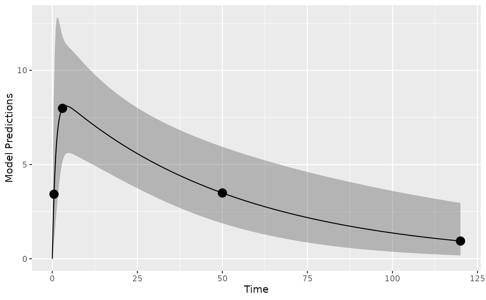
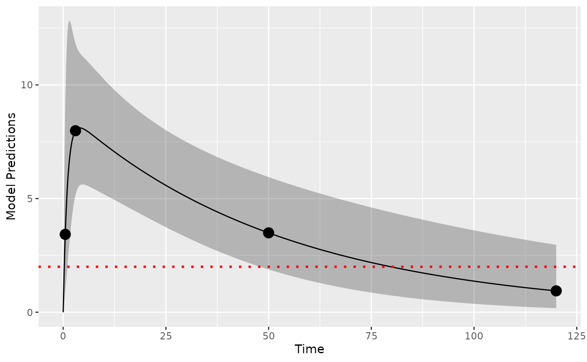
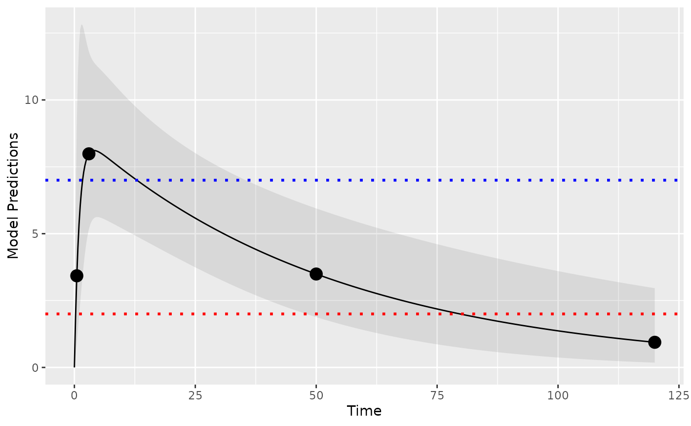
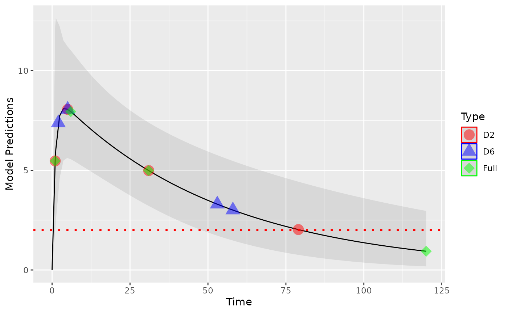

# Optimal design with LOQ data in PopED

## Define a model

Here we define, as an example, a one-compartment pharmacokinetic model
with linear absorption (analytic solution) in PopED ([Nyberg et al.
2012](#ref-Nyberg2012a)).

``` r
library(PopED)
packageVersion("PopED")
#> [1] '0.7.0.9001'
```

``` r
ff <- function(model_switch,xt,parameters,poped.db){
  with(as.list(parameters),{
    y=xt
    y=(DOSE*KA/(V*(KA-CL/V)))*(exp(-CL/V*xt)-exp(-KA*xt))
    return(list(y=y,poped.db=poped.db))
  })}
```

Next we define the parameters of this function. `DOSE`is defined as a
covariate (in vector `a`) so that we can optimize the value later.

``` r
sfg <- function(x,a,bpop,b,bocc){
  parameters=c( CL=bpop[1]*exp(b[1]),
                V=bpop[2]*exp(b[2]),
                KA=bpop[3]*exp(b[3]),
                DOSE=a[1])
}
```

We will use an additive and proportional residual unexplained
variability (RUV) model, predefined in PopED as the function
`feps.add.prop`.

## Define an initial design and design space

Now we define the model parameter values, the initial design and design
space for optimization. We define model parameters similar to the
Warfarin example from the software comparison in Nyberg et al.
([2015](#ref-nyberg2015)) and an arbitrary design of one group of 32
individuals.

``` r
poped_db <- 
  create.poped.database(
    ff_fun=ff,
    fg_fun=sfg,
    fError_fun=feps.add.prop,
    bpop=c(CL=0.15, V=8, KA=1.0), 
    d=c(CL=0.07, V=0.02, KA=0.6), 
    sigma=c(prop=0.01,add=0.25),
    groupsize=32,
    xt=c( 0.5,3,50,120),
    discrete_xt = list(c(0.5,1:120)),
    minxt=0,
    maxxt=120,
    a=70,
    mina=0,
    maxa=100)
                                
```

## Simulation

First it may make sense to check the model and design to make sure we
get what we expect when simulating data. Here we plot the model typical
value and a 95% prediction interval (PI) for the intial design:

``` r
plot_model_prediction(poped_db, model_num_points = 500,facet_scales = "free",PI=T)
```



## Design evaluation

Next, we evaluate the initial design.

``` r
eval_full <- evaluate_design(poped_db)
round(eval_full$rse)
```

|          | RSE |
|:---------|----:|
| CL       |   5 |
| V        |   4 |
| KA       |  15 |
| d_CL     |  34 |
| d_V      |  70 |
| d_KA     |  28 |
| sig_prop |  89 |
| sig_add  |  36 |

We see that the relative standard error of the parameters (in percent)
are relatively well estimated with this initial design except for the
between subject variability parameter for volume of distribution (`d_V`)
and the proportional RUV parameter (`sig_prop`).

## LOQ handling

We assume that the LOQ level is at 2 concentration units. Here shown as
a red dotted line.

``` r
library(ggplot2)
plot_model_prediction(poped_db, model_num_points = 500,facet_scales = "free",PI=T) + 
  geom_hline(yintercept = 2,color="red",linetype="dotted",linewidth=1)
```



To evaluate the designs we use the design evaluation criteria based on
the “integration and FIM scaling” method (`loq_method=1` which is the
default) and the “omit observations where PRED\<LOQ” method
(`loq_method=2`) from Vong et al. ([2012](#ref-vong2012)) (referred to
as the D6 and D2 methods, respectively, in the presentation by Vong et
al.). In the D6 method we:

1.  Enumerate all permutations of each sample point being quantifiable
    or not (below the lower LOQ, or above the upper LOQ). If sample
    points have an expected prediction interval (default is 95%,
    `loq_PI_conf_level = 0.95`) that does not overlap the LOQ then the
    design point is assumed to either always be observed or to always be
    outside the limit of quantification.

2.  Compute the probability of each permutation occurring, filtering out
    potential realized designs with very low probabilities (default is
    `loq_prob_limit = 0.001`).

3.  Evalaute the Fisher Information Matrix (FIM) for all remaining
    design permutations, assuming no information from any design point
    if, for that permutation, it is not in within the limits of
    quantification.

4.  Take the weighted sum of the resulting information matrices.

The D2 method is a simplification of this process where all samples with
a typical value prediction (PRED) below the lower LOQ or above upper LOQ
are removed from the design before calculating the FIM.

Here we evaluate the initial design with both methods and test the speed
of the computations. We see that D6 is significantly slower than D2 (but
D6 should be a more accurate representation of the RSE expected using M3
estimation methods).

``` r
set.seed(1234)
e_time_D6 <- system.time(
  eval_D6 <- evaluate_design(poped_db,loq=2)
)

e_time_D2 <- system.time(
  eval_D2 <- evaluate_design(poped_db,loq=2, loq_method=2)
)

cat("D6 evaluation time: ",e_time_D6[1],"seconds \n" )
cat("D2 evaluation time: ",e_time_D2[1],"deconds \n" )
#> D6 evaluation time:  0.043 seconds 
#> D2 evaluation time:  0.007 deconds
```

The D2 method is the same as removing the last design point, as you can
se below.

``` r
poped_db_2 <- create.poped.database(
    ff_fun=ff,
    fg_fun=sfg,
    fError_fun=feps.add.prop,
    bpop=c(CL=0.15, V=8, KA=1.0), 
    d=c(CL=0.07, V=0.02, KA=0.6), 
    sigma=c(prop=0.01,add=0.25),
    groupsize=32,
    xt=c( 0.5,3,50),
    discrete_xt = list(c(0.5,1:120)),
    minxt=0,
    maxxt=120,
    a=70,
    mina=0,
    maxa=100)
eval_red <- evaluate_design(poped_db_2)
testthat::expect_equal(eval_red$ofv,eval_D2$ofv)
testthat::expect_equal(eval_red$rse,eval_D2$rse)
```

The predicted parameter uncertainty for the three methods is shown in
the table below (as relative standard error, RSE, in percent). We see
that the uncertainty is generally higher with the LOQ evaluations (as
expected). We also see that the predictions of uncertainty are
significantly larger than the D6 method. This too is expected, because
the D2 method ignores design points where the model PRED is below LOQ
(the last observation in the design), whereas it appears from the
previous figure that ~25% of the observations from the last design point
will be above LOQ. The M6 method accounts for this probability that the
last design point will have data above LOQ and is thus a more realistic
assessment of the expected parameter uncertainty.

| Parameter | No LOQ |  D6 |   D2 |
|:----------|-------:|----:|-----:|
| CL        |      5 |   6 |    6 |
| V         |      4 |   4 |    4 |
| KA        |     15 |  17 |   15 |
| d_CL      |     34 |  50 |  498 |
| d_V       |     70 | 109 |  428 |
| d_KA      |     28 |  33 |  113 |
| sig_prop  |     89 | 161 | 1444 |
| sig_add   |     36 | 118 | 2127 |

### ULOQ handling

If needed we can also handle upper limits of quantification. Lets assume
we have an ULOQ at 7 units in addition to the LLOQ of 2 units:

``` r
library(ggplot2)
plot_model_prediction(poped_db, model_num_points = 500,facet_scales = "free",
                      PI=T, PI_alpha = 0.1) + 
  geom_hline(yintercept = 2,color="red",linetype="dotted",linewidth=1) + 
  geom_hline(yintercept = 7,color="blue",linetype="dotted",linewidth=1)
```



We can then evaluate the design based on the D2 and D6 methods.

``` r
eval_ul_D6 <-evaluate_design(poped_db,
                loq=2,
                uloq=7)

eval_ul_D2 <- evaluate_design(poped_db,
                                loq=2,
                                loq_method=2,
                                uloq=7,
                                uloq_method=2)
#> Problems inverting the matrix. Results could be misleading.
```

And then look at the predicted RSE in percent.

``` r
eval_rse_2 <-
  tibble::tibble("Parameter"=names(eval_full$rse),
                 "No LOQ"=round(eval_full$rse),
                 "D6 (only LLOQ)"=round(eval_D6$rse),
                 "D2 (only LLOQ)"=round(eval_D2$rse),
                 "D6 (ULOQ and LLOQ)"=round(eval_ul_D6$rse),
                 "D2 (ULOQ and LLOQ)"=round(eval_ul_D2$rse))
eval_rse_2
```

| Parameter | No LOQ | D6 (only LLOQ) | D2 (only LLOQ) | D6 (ULOQ and LLOQ) | D2 (ULOQ and LLOQ) |
|:----------|-------:|---------------:|---------------:|-------------------:|-------------------:|
| CL        |      5 |              6 |              6 |                  6 |                  6 |
| V         |      4 |              4 |              4 |                  8 |                  0 |
| KA        |     15 |             17 |             15 |                 21 |                 14 |
| d_CL      |     34 |             50 |            498 |                 59 |                276 |
| d_V       |     70 |            109 |            428 |                203 |               1743 |
| d_KA      |     28 |             33 |            113 |                 35 |                 55 |
| sig_prop  |     89 |            161 |           1444 |                297 |               1645 |
| sig_add   |     36 |            118 |           2127 |                122 |                  6 |

## Design optimization

Next, we optimize the design using the different methods of computing
the FIM. Here we optimize only using the lower LOQ.

``` r
optim_D6 <- poped_optim(poped_db, opt_xt = TRUE,
                        parallel=T,
                        loq=2)

optim_D2 <- poped_optim(poped_db, opt_xt = TRUE,
                        parallel=T,
                        loq=2,
                        loq_method=2)

optim_full <- poped_optim(poped_db, opt_xt = TRUE,
                        parallel=T)
```

All designs points shown together in one plot to demonstrate how the
different handling of BLQ data results in different optimal designs. The
“full” design, ignoring LOQ, places a design point at the end of the
sampling space, which will results in many observations below LOQ. Both
the D2 and D6 methods push the design points to regions where fewer LOQ
observations will occur.  


To compare the effects of these different designs on parameter
precision, we evaluate each of the optimal designs above using the D6
method.

``` r
optim_full_D6<- with(optim_full, 
  evaluate_design(poped.db,
                  loq=2))

optim_D2_D6<- with(optim_D2, 
  evaluate_design(poped.db,
                  loq=2))

optim_D6_D6<- with(optim_D6, 
  evaluate_design(poped.db,
                  loq=2))
```

The expected %RSE of the parameters is shown below. We see that the D6
optimized design gives, on average, the best parameter precision. The D2
optimal design stragetgy may be a reasonable obtain designs that are
“good enough” if the D6 method is too slow for optimization.

``` r
optim_rse_D6 <-
  tibble::tibble("Parameter"=names(eval_full$rse),
                 "No LOQ"=round(optim_full_D6$rse),
                 "D6"=round(optim_D6_D6$rse),
                 "D2"=round(optim_D2_D6$rse))
optim_rse_D6
```

| Parameter | No LOQ |  D6 |  D2 |
|:----------|-------:|----:|----:|
| CL        |      7 |   5 |   6 |
| V         |      4 |   3 |   3 |
| KA        |     16 |  17 |  16 |
| d_CL      |     67 |  34 |  43 |
| d_V       |     58 |  54 |  52 |
| d_KA      |     30 |  39 |  30 |
| sig_prop  |    114 |  96 |  93 |
| sig_add   |    152 |  60 |  92 |

## References

Nyberg, Joakim, Caroline Bazzoli, Kay Ogungbenro, Alexander Aliev,
Sergei Leonov, Stephen Duffull, Andrew C Hooker, and France Mentré.
2015. “Methods and software tools for design evaluation in population
pharmacokinetics-pharmacodynamics studies.” *British Journal of Clinical
Pharmacology* 79 (1): 6–17. <https://doi.org/10.1111/bcp.12352>.

Nyberg, Joakim, Sebastian Ueckert, Eric A. Strömberg, Stefanie Hennig,
Mats O. Karlsson, and Andrew C. Hooker. 2012. “PopED: An extended,
parallelized, nonlinear mixed effects models optimal design tool.”
*Computer Methods and Programs in Biomedicine* 108 (2): 789–805.
<https://doi.org/10.1016/j.cmpb.2012.05.005>.

Vong, Camille, Sebastian Ueckert, Joakim Nyberg, and Andrew C. Hooker.
2012. “Handling Below Limit of Quantification Data in Optimal Trial
Design.” *PAGE, Abstracts of the Annual Meeting of the Population
Approach Group in Europe*.
<https://www.page-meeting.org/?abstract=2578>.

## Version information

``` r
sessionInfo()
#> R version 4.6.0 (2026-04-24)
#> Platform: x86_64-pc-linux-gnu
#> Running under: Ubuntu 24.04.4 LTS
#> 
#> Matrix products: default
#> BLAS:   /usr/lib/x86_64-linux-gnu/openblas-pthread/libblas.so.3 
#> LAPACK: /usr/lib/x86_64-linux-gnu/openblas-pthread/libopenblasp-r0.3.26.so;  LAPACK version 3.12.0
#> 
#> locale:
#>  [1] LC_CTYPE=C.UTF-8       LC_NUMERIC=C           LC_TIME=C.UTF-8       
#>  [4] LC_COLLATE=C.UTF-8     LC_MONETARY=C.UTF-8    LC_MESSAGES=C.UTF-8   
#>  [7] LC_PAPER=C.UTF-8       LC_NAME=C              LC_ADDRESS=C          
#> [10] LC_TELEPHONE=C         LC_MEASUREMENT=C.UTF-8 LC_IDENTIFICATION=C   
#> 
#> time zone: UTC
#> tzcode source: system (glibc)
#> 
#> attached base packages:
#> [1] stats     graphics  grDevices utils     datasets  methods   base     
#> 
#> other attached packages:
#> [1] PopED_0.7.0.9001 kableExtra_1.4.0 knitr_1.51       ggplot2_4.0.3   
#> 
#> loaded via a namespace (and not attached):
#>  [1] utf8_1.2.6         sass_0.4.10        generics_0.1.4     xml2_1.5.2        
#>  [5] gtools_3.9.5       stringi_1.8.7      digest_0.6.39      magrittr_2.0.5    
#>  [9] evaluate_1.0.5     grid_4.6.0         RColorBrewer_1.1-3 mvtnorm_1.3-7     
#> [13] pkgload_1.5.2      fastmap_1.2.0      rprojroot_2.1.1    jsonlite_2.0.0    
#> [17] brio_1.1.5         viridisLite_0.4.3  scales_1.4.0       codetools_0.2-20  
#> [21] textshaping_1.0.5  jquerylib_0.1.4    cli_3.6.6          rlang_1.2.0       
#> [25] withr_3.0.2        cachem_1.1.0       yaml_2.3.12        otel_0.2.0        
#> [29] tools_4.6.0        dplyr_1.2.1        vctrs_0.7.3        R6_2.6.1          
#> [33] lifecycle_1.0.5    stringr_1.6.0      fs_2.1.0           htmlwidgets_1.6.4 
#> [37] ragg_1.5.2         pkgconfig_2.0.3    desc_1.4.3         pkgdown_2.2.0     
#> [41] pillar_1.11.1      bslib_0.10.0       gtable_0.3.6       glue_1.8.1        
#> [45] systemfonts_1.3.2  xfun_0.57          tibble_3.3.1       tidyselect_1.2.1  
#> [49] rstudioapi_0.18.0  farver_2.1.2       htmltools_0.5.9    rmarkdown_2.31    
#> [53] svglite_2.2.2      labeling_0.4.3     testthat_3.3.2     compiler_4.6.0    
#> [57] S7_0.2.2
```
