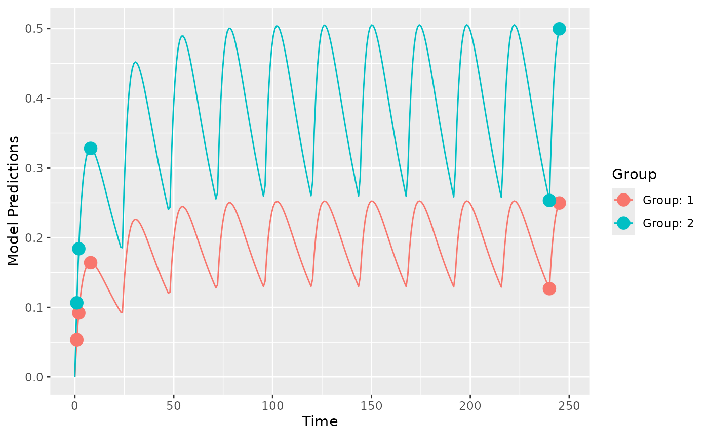
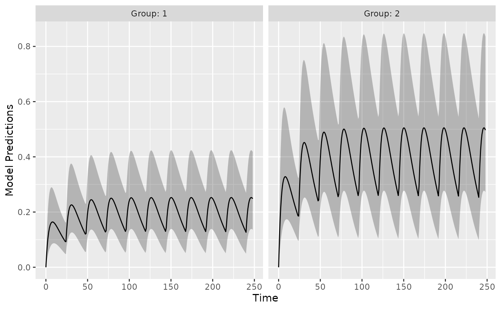
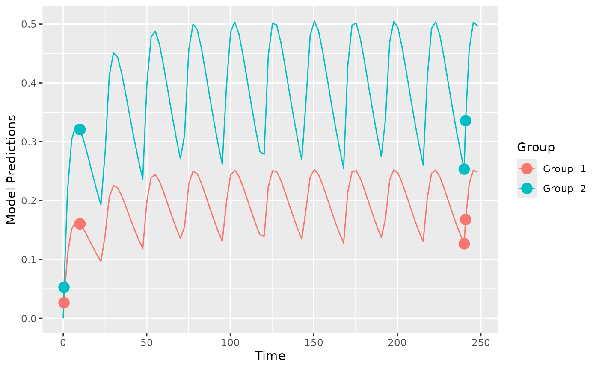
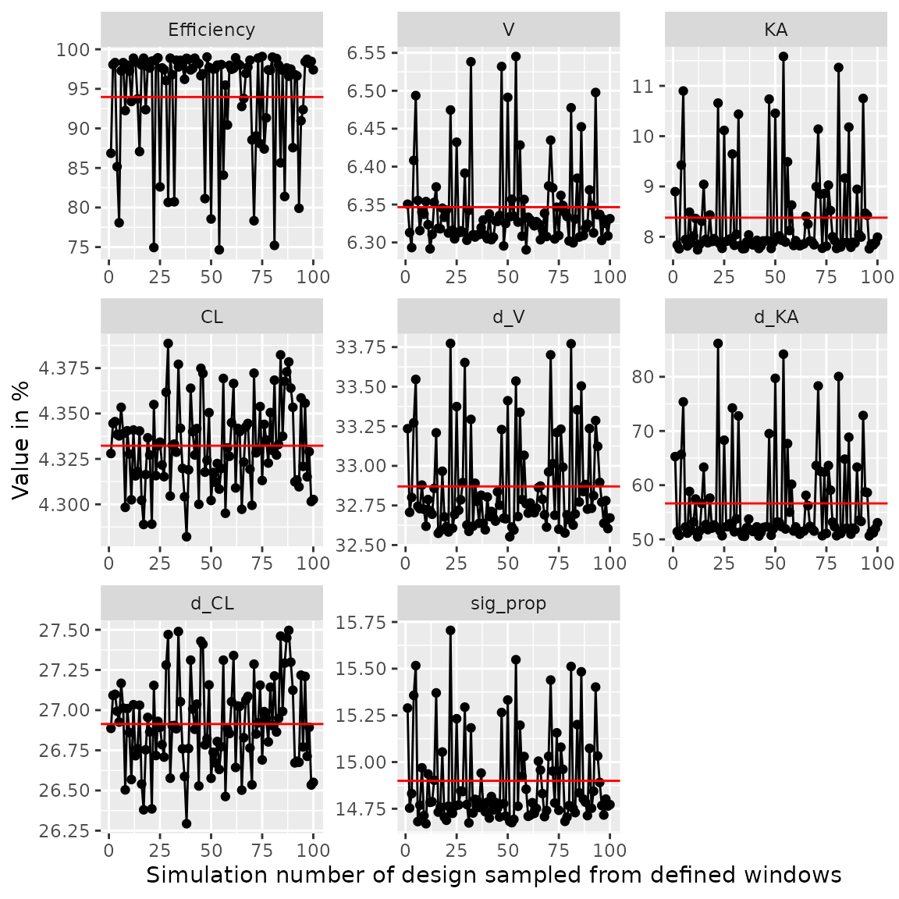
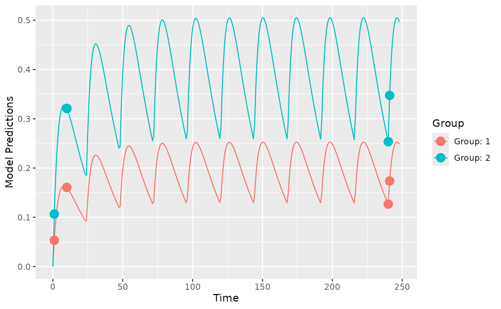
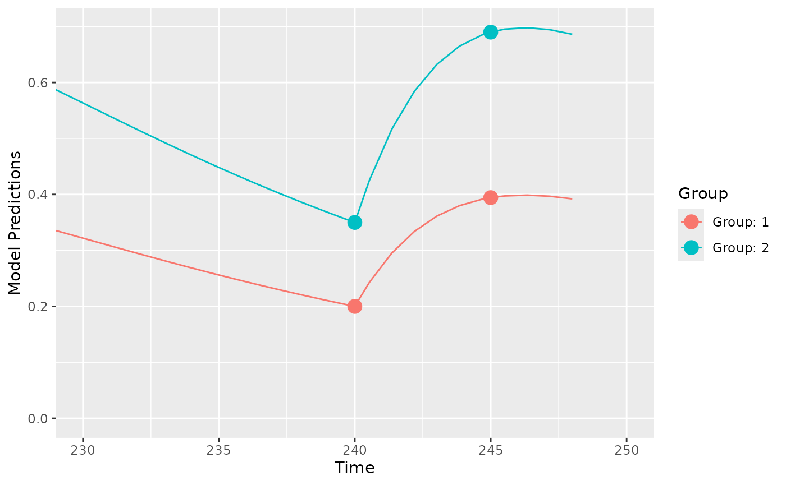

# Introduction to PopED

PopED computes optimal experimental designs for both population and
individual studies based on nonlinear mixed-effect models. Often this is
based on a computation of the Fisher Information Matrix (FIM).

To get started you need to define

- A model.
- An initial design (and design space if you want to optimize)
- The tasks to perform.

There are a number of functions to help you with these tasks. See
`?poped` for more information.

Below is an example to introduce the package. Several other examples are
available as r-scripts in the “examples” folder in the PopED
installation directory located at:

``` r
system.file("examples", package="PopED")
```

You can view a list of the example files using the commands:

``` r
ex_dir <- system.file("examples", package="PopED")
list.files(ex_dir)
```

You can then open one of the examples (for example,
`ex.1.a.PK.1.comp.oral.md.intro.R`, is very similar to the code found in
this vignette) using the following code

``` r
file_name <- "ex.1.a.PK.1.comp.oral.md.intro.R"
ex_file <- system.file("examples",file_name,package="PopED")
file.copy(ex_file,tempdir(),overwrite = T)
file.edit(file.path(tempdir(),file_name))
```

In addition, there is another vignette called “Examples” that explores
the new features in each example.

## Define a model

Here we define a one-compartment pharmacokinetic model with linear
absorption using an analytical solution. In this case the solution is
applicable for both multiple and single dosing. Note that this function
is also predefined in PopED as `ff.PK.1.comp.oral.md.CL` (see
[`?ff.PK.1.comp.oral.md.CL`](https://andrewhooker.github.io/PopED/dev/reference/ff.PK.1.comp.oral.md.CL.md)
for more information).

``` r
library(PopED)
packageVersion("PopED")
#> [1] '0.7.0.9001'
```

``` r
ff <- function(model_switch,xt,parameters,poped.db){
  with(as.list(parameters),{
    N = floor(xt/TAU)+1
    f=(DOSE*Favail/V)*(KA/(KA - CL/V)) * 
      (exp(-CL/V * (xt - (N - 1) * TAU)) * (1 - exp(-N * CL/V * TAU))/(1 - exp(-CL/V * TAU)) - 
         exp(-KA * (xt - (N - 1) * TAU)) * (1 - exp(-N * KA * TAU))/(1 - exp(-KA * TAU)))  
    return(list( f=f,poped.db=poped.db))
  })
}
```

Next we define the parameters of this function, in this case the
between-subject variability (BSV) for each parameter is log-normally
distributed (parameter `Favail` is assumed not to have BSV). `DOSE` and
`TAU` are defined as covariates (in vector `a`) so that we can optimize
their values later.

``` r
sfg <- function(x,a,bpop,b,bocc){
  parameters=c( V=bpop[1]*exp(b[1]),
                KA=bpop[2]*exp(b[2]),
                CL=bpop[3]*exp(b[3]),
                Favail=bpop[4],
                DOSE=a[1],
                TAU=a[2])
}
```

Now we define the residual unexplained variability (RUV) function, in
this case the RUV has both an additive and proportional component.

``` r
feps <- function(model_switch,xt,parameters,epsi,poped.db){
  returnArgs <- ff(model_switch,xt,parameters,poped.db) 
  f <- returnArgs[[1]]
  poped.db <- returnArgs[[2]]
 
  y = f*(1+epsi[,1])+epsi[,2]
  
  return(list(y=y,poped.db=poped.db)) 
}
```

## Create a PopED database

We create a poped database to link the model defined above with a set of
model parameters, the initial design and design space for optimization.

In this example, the parameter values are defined for the fixed effects
(`bpop`), the between-subject variability variances (`d`) and the
residual variability variances (`sigma`). We also fix the parameter
`Favail` using `notfixed_bpop`, since we have only oral dosing and the
parameter is not identifiable. Fixing a parameter means that we assume
the parameter will not be estimated (and is know without uncertainty).
In addition, we fix the small additive RUV term, as this term is
reflecting the higher error expected at low concentration measurements
(limit of quantification measurements) and would typically be calculated
from analytical assay methods (for example, the standard deviation of
the parameter might be 20% of the limit of quantification).

For the initial design, we define two groups (`m=2`) of 20 individuals
(`groupsize=20`), with doses of 20 mg or 40 mg every 24 hours (`a`). The
initial design has 5 sample times per individual (`xt`).

For the design space, which can be searched during optimization, we
define a potential dose range of between 0 and 200 mg (`mina` and
`maxa`), and a range of potential sample times between 0 and 10 hours
for the first three samples and between 240 and 248 hours for the last
two samples (`minxt` and `maxxt`). Finally, we fix the two groups of
subjects to have the same sample times (`bUseGrouped_xt=TRUE`).

``` r
poped.db <- create.poped.database(
  # Model
  ff_fun=ff,
  fg_fun=sfg,
  fError_fun=feps,
  bpop=c(V=72.8,KA=0.25,CL=3.75,Favail=0.9), 
  notfixed_bpop=c(1,1,1,0),
  d=c(V=0.09,KA=0.09,CL=0.25^2), 
  sigma=c(prop=0.04,add=5e-6),
  notfixed_sigma=c(1,0),
  
  # Design
  m=2,
  groupsize=20,
  a=list(c(DOSE=20,TAU=24),c(DOSE=40, TAU=24)),
  maxa=c(DOSE=200,TAU=24),
  mina=c(DOSE=0,TAU=24),
  xt=c( 1,2,8,240,245),
  
  # Design space
  minxt=c(0,0,0,240,240),
  maxxt=c(10,10,10,248,248),
  bUseGrouped_xt=TRUE)
```

## Design simulation

First it may make sense to check your model and design to make sure you
get what you expect when simulating data. Here we plot the model typical
values:

``` r
plot_model_prediction(poped.db, model_num_points = 300)
```



Next, we plot the expected prediction interval (by default a 95% PI) of
the data taking into account the BSV and RUV using the option `PI=TRUE`.
This option makes predictions based on first-order approximations to the
model variance and a normality assumption of that variance. Better (and
slower) computations are possible with the `DV=T`, `IPRED=T` and
`groupsize_sim = some large number` options.

``` r
plot_model_prediction(poped.db, 
                      PI=TRUE, 
                      separate.groups=T, 
                      model_num_points = 300, 
                      sample.times = FALSE)
```



We can get these predictions numerically as well:

``` r
dat <- model_prediction(poped.db,DV=TRUE)
head(dat,n=5);tail(dat,n=5)
#>   ID Time         DV      IPRED       PRED Group Model DOSE TAU
#> 1  1    1 0.09659927 0.08034839 0.05325024     1     1   20  24
#> 2  1    2 0.13172074 0.13415072 0.09204804     1     1   20  24
#> 3  1    8 0.19502544 0.19134279 0.16409609     1     1   20  24
#> 4  1  240 0.04847782 0.05881203 0.12671376     1     1   20  24
#> 5  1  245 0.29770447 0.23457544 0.24980320     1     1   20  24
#>     ID Time         DV     IPRED      PRED Group Model DOSE TAU
#> 196 40    1 0.04411438 0.0583122 0.1065005     2     1   40  24
#> 197 40    2 0.10599655 0.1039377 0.1840961     2     1   40  24
#> 198 40    8 0.20262746 0.2206604 0.3281922     2     1   40  24
#> 199 40  240 0.17506051 0.3788561 0.2534275     2     1   40  24
#> 200 40  245 0.56558539 0.5183551 0.4996064     2     1   40  24
```

## Design evaluation

Next, we evaluate the initial design

``` r
(ds1 <- evaluate_design(poped.db))
#> $ofv
#> [1] 39.309
#> 
#> $fim
#>                    V          KA           CL        d_V       d_KA        d_CL
#> V         0.05336692   -8.683963  -0.05863412   0.000000   0.000000    0.000000
#> KA       -8.68396266 2999.851007 -14.43058560   0.000000   0.000000    0.000000
#> CL       -0.05863412  -14.430586  37.15243290   0.000000   0.000000    0.000000
#> d_V       0.00000000    0.000000   0.00000000 999.953587 312.240246    3.202847
#> d_KA      0.00000000    0.000000   0.00000000 312.240246 439.412556    2.287838
#> d_CL      0.00000000    0.000000   0.00000000   3.202847   2.287838 3412.005199
#> sig_prop  0.00000000    0.000000   0.00000000 575.347261 638.581909 1182.325475
#>            sig_prop
#> V            0.0000
#> KA           0.0000
#> CL           0.0000
#> d_V        575.3473
#> d_KA       638.5819
#> d_CL      1182.3255
#> sig_prop 33864.3226
#> 
#> $rse
#>         V        KA        CL       d_V      d_KA      d_CL  sig_prop 
#>  8.215338 10.090955  4.400304 39.844763 60.655110 27.562541 13.865357
```

We see that the fixed-effect and residual variability parameters are
relatively well estimated with this design, but the between-subject
variability parameters are less well estimated.

### Evaluate alternative design

What about an alternative design with sparse sampling? For example, what
if each individual only has 3 time points at 1, 2 and 245 hours:

``` r
poped.db.new <- create.poped.database(
  # Model
  ff_fun=ff,
  fg_fun=sfg,
  fError_fun=feps,
  bpop=c(V=72.8,KA=0.25,CL=3.75,Favail=0.9), 
  notfixed_bpop=c(1,1,1,0),
  d=c(V=0.09,KA=0.09,CL=0.25^2), 
  sigma=c(prop=0.04,add=5e-6),
  notfixed_sigma=c(1,0),
  
  # Design
  m=2,
  groupsize=20,
  a=list(c(DOSE=20,TAU=24),c(DOSE=40, TAU=24)),
  maxa=c(DOSE=200,TAU=24),
  mina=c(DOSE=0,TAU=24),
  xt=c( 1,2,245),
                                      
  # Design space
  minxt=c(0,0,240),
  maxxt=c(10,10,248),
  bUseGrouped_xt=TRUE)
```

``` r
(ds2 <- evaluate_design(poped.db.new))
#> $ofv
#> [1] 29.66484
#> 
#> $fim
#>                     V         KA           CL        d_V       d_KA        d_CL
#> V          0.04243232  -10.51432   0.05782431   0.000000   0.000000    0.000000
#> KA       -10.51432135 2666.25466 -14.66678102   0.000000   0.000000    0.000000
#> CL         0.05782431  -14.66678  21.59743298   0.000000   0.000000    0.000000
#> d_V        0.00000000    0.00000   0.00000000 632.163776 457.737062    3.115099
#> d_KA       0.00000000    0.00000   0.00000000 457.737062 347.115999    2.363458
#> d_CL       0.00000000    0.00000   0.00000000   3.115099   2.363458 1153.026981
#> sig_prop   0.00000000    0.00000   0.00000000 348.477101 262.369792 1979.231386
#>            sig_prop
#> V            0.0000
#> KA           0.0000
#> CL           0.0000
#> d_V        348.4771
#> d_KA       262.3698
#> d_CL      1979.2314
#> sig_prop 15617.8185
#> 
#> $rse
#>          V         KA         CL        d_V       d_KA       d_CL   sig_prop 
#>  44.120338  51.256239   5.748842 207.941540 280.689945  53.350716  22.795275
```

### Comparison of designs

The precision on CL is similar with the alternative design but the other
parameters are less well estimated.

``` r
(design_eval <- round(data.frame("Design 1"=ds1$rse,"Design 2"=ds2$rse)))
```

|          | Design.1 | Design.2 |
|:---------|---------:|---------:|
| V        |        8 |       44 |
| KA       |       10 |       51 |
| CL       |        4 |        6 |
| d_V      |       40 |      208 |
| d_KA     |       61 |      281 |
| d_CL     |       28 |       53 |
| sig_prop |       14 |       23 |

Comparing the objective function value (OFV), we see that the
alternative design (less samples per subject) has a smaller OFV
(=worse). We can compare the two OFVs using efficiency, which tells us
the proportion extra individuals that are needed in the alternative
design to have the same information content as the original design
(around 4 times more individuals than are currently in the design).

``` r
efficiency(ds2$ofv,ds1$ofv,poped.db)
#> [1] 3.965919
#> attr(,"description")
#> [1] "(exp(ofv_final) / exp(ofv_init))^(1/n_parameters)"
```

## Design optimization

Now we can optimize the sample times of the original design by
maximizing the OFV[¹](#fn1).

``` r
output <- poped_optim(poped.db, opt_xt=TRUE)
```

``` r
summary(output)
#> ===============================================================================
#> FINAL RESULTS
#> Optimized Sampling Schedule
#> Group 1: 0.4573     10     10    240  240.9
#> Group 2: 0.4573     10     10    240  240.9
#> 
#> OFV = 40.5277
#> 
#> Efficiency: 
#>   ((exp(ofv_final) / exp(ofv_init))^(1/n_parameters)) = 1.1902
#> 
#> Expected relative standard error
#> (%RSE, rounded to nearest integer):
#>    Parameter   Values   RSE_0   RSE
#>            V     72.8       8     6
#>           KA     0.25      10     8
#>           CL     3.75       4     4
#>          d_V     0.09      40    33
#>         d_KA     0.09      61    50
#>         d_CL   0.0625      28    26
#>     sig_prop     0.04      14    15
#> 
#> Total running time: 16.441 seconds
plot_model_prediction(output$poped.db)
```



We see that there are four distinct sample times for this design. This
means that for this model, with these exact parameter values, that the
most information from the study to inform the parameter estimation is
with these sample times.

### Examine efficiency of sampling windows

Of course, this means that there are multiple samples at some of these
time points. We can explore a more practical design by looking at the
loss of efficiency if we spread out sample times in a uniform
distribution around these optimal points ($\pm 30$ minutes).

``` r
plot_efficiency_of_windows(output$poped.db,xt_windows=0.5)
```



Here we see the efficiency
($\left( \left| FIM_{optimized} \right|/\left| FIM_{initial} \right| \right)^{1/npar}$)
drops below 80% in some cases, which is mostly caused by an increase in
the parameter uncertainty of the BSV parameter on absorption (om_KA).
Smaller windows or different windowing on different samples might be
needed. To investigate see
[`?plot_efficiency_of_windows`](https://andrewhooker.github.io/PopED/dev/reference/plot_efficiency_of_windows.md).

### Optimize over a discrete design space

In the previous example we optimized over a continuous design space
(sample times could be optimized to be any value between a lower and an
upper limit). We could also limit the search to only “allowed” values,
for example, only samples taken on the hour are allowed.

``` r
poped.db.discrete <- create.poped.database(poped.db,discrete_xt = list(c(0:10,240:248)))
                                          
output_discrete <- poped_optim(poped.db.discrete, opt_xt=TRUE)
```

``` r
summary(output_discrete)
#> ===============================================================================
#> FINAL RESULTS
#> Optimized Sampling Schedule
#> Group 1:      1     10     10    240    241
#> Group 2:      1     10     10    240    241
#> 
#> OFV = 40.3782
#> 
#> Efficiency: 
#>   ((exp(ofv_final) / exp(ofv_init))^(1/n_parameters)) = 1.165
#> 
#> Expected relative standard error
#> (%RSE, rounded to nearest integer):
#>    Parameter   Values   RSE_0   RSE
#>            V     72.8       8     6
#>           KA     0.25      10     8
#>           CL     3.75       4     4
#>          d_V     0.09      40    32
#>         d_KA     0.09      61    53
#>         d_CL   0.0625      28    27
#>     sig_prop     0.04      14    15
#> 
#> Total running time: 9.973 seconds
plot_model_prediction(output_discrete$poped.db, model_num_points = 300)
```



Here we see that the optimization ran somewhat quicker, but gave a less
efficient design.

### Optimize ‘Other’ design variables

One could also optimize over dose, to see if a different dose could help
in parameter estimation .

``` r
output_dose_opt <- poped_optim(output$poped.db, opt_xt=TRUE, opt_a=TRUE)
```

In this case the results are predictable … higher doses give
observations with somewhat lower absolute residual variability leading
to both groups at the highest allowed dose levels (200 mg in this case).

### Cost function to optimize dose

Optimizing the dose of a study just to have better model parameter
estimates may be somewhat implausible. Instead, let’s use a cost
function to optimize dose based on some sort of target concentration …
perhaps typical population trough concentrations of 0.2 and 0.35 for the
two groups of patients at 240 hours.

First we define the criteria we use to optimize the doses, here a least
squares minimization.

``` r
crit_fcn <- function(poped.db,...){
  pred_df <- model_prediction(poped.db)
  sum((pred_df[pred_df["Time"]==240,"PRED"] - c(0.2,0.35))^2)
}
crit_fcn(output$poped.db)
#> [1] 0.01469712
```

Now we minimize the cost function

``` r
output_cost <- poped_optim(poped.db, opt_a = TRUE, opt_xt = FALSE,
                     ofv_fun=crit_fcn, 
                     maximize = FALSE)
```

``` r
summary(output_cost)
#> ===============================================================================
#> FINAL RESULTS
#> 
#> Optimized Covariates:
#> Group 1: 31.5672 : 24
#> Group 2: 55.2426 : 24
#> 
#> OFV = 6.09293e-15
#> 
#> Efficiency: 
#>   (ofv_final / ofv_init) = 4.1457e-13
#> 
#> Expected relative standard error
#> (%RSE, rounded to nearest integer):
#>    Parameter   Values   RSE_0   RSE
#>            V     72.8       8     8
#>           KA     0.25      10    10
#>           CL     3.75       4     4
#>          d_V     0.09      40    40
#>         d_KA     0.09      61    60
#>         d_CL   0.0625      28    28
#>     sig_prop     0.04      14    14
#> 
#> Total running time: 3.498 seconds
```

We see that the optimal doses are 31.6 and 55.2 for the two groups. This
leads to population trough concentrations of 0.2 and 0.35 for the two
groups of patients at 240 hours:

``` r
library(ggplot2)
plot_model_prediction(output_cost$poped.db, model_num_points = 300)+
  coord_cartesian(xlim=c(230,250))
```



------------------------------------------------------------------------

1.  Tip: to make the optimization run faster use the option
    `parallel = TRUE` in the `poped_optim` command.
