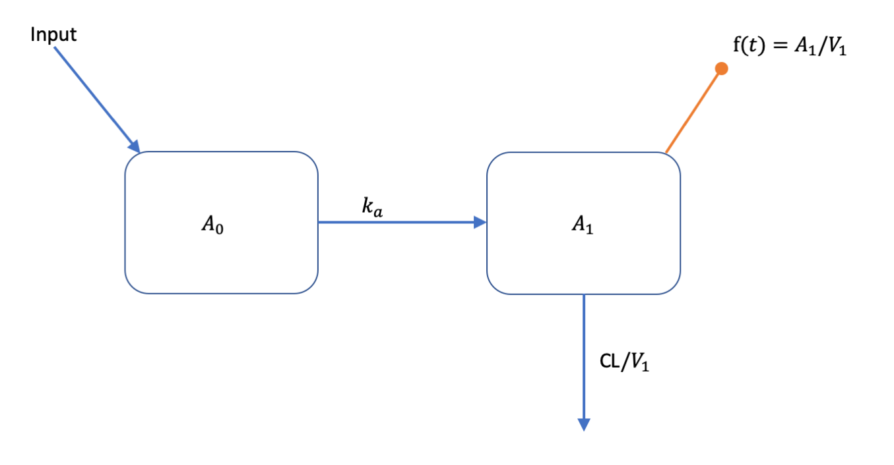
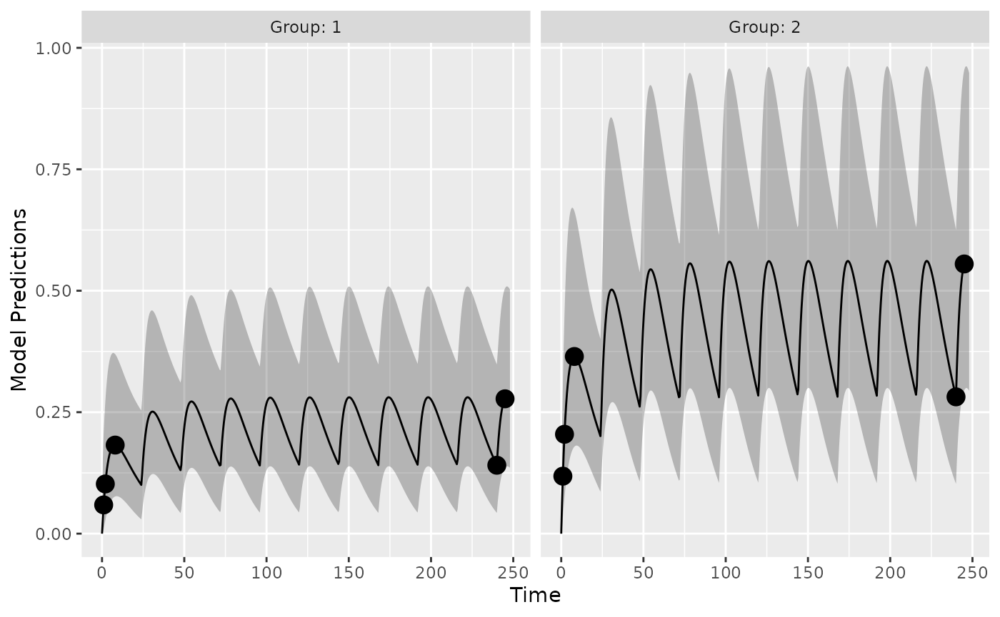
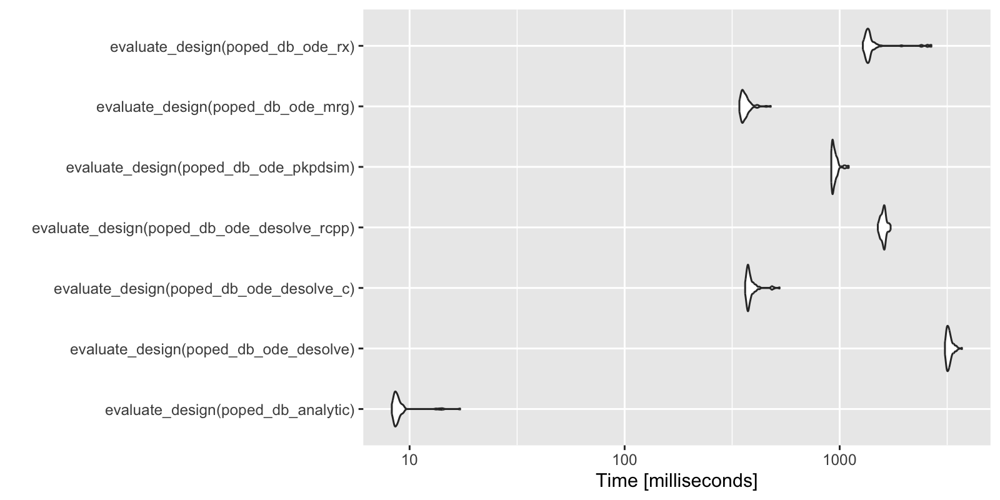

# Defining models for PopED using R based PKPD simulators

## Introduction

This is a simple example on how to couple PopED with external R based
PKPD simulation tools. Typically, these tools might be R packages that
can simulate from ordinary differential equation (ODE) based models. In
this document you will see how to couple PopED to models, defined with
ODEs, implemented using:

- deSolve (with native R ODE models)
- deSolve (with compiled C ODE models)
- deSolve (with compiled C++ ODE models using Rcpp)
- PKPDsim
- mrgsolve
- rxode2

``` r
library(PopED)
library(PKPDsim)
library(mrgsolve)
#> 
#> Attaching package: 'mrgsolve'
#> The following object is masked from 'package:stats':
#> 
#>     filter
library(deSolve)
library(Rcpp)
library(rxode2)
#> rxode2 5.0.2 using 2 threads (see ?getRxThreads)
#>   no cache: create with `rxCreateCache()`
```

## The model

We will use a one-compartment with linear absorption population
pharmacokinetic (PK) model as an example (see below).



This model can be described with the following set of ODEs:

$$\begin{aligned}
\frac{dA_{0}}{dt} & {= - k_{a} \cdot A_{0}} \\
\frac{dA_{1}}{dt} & {= - \left( CL/V_{1} \right) \cdot A_{1} + k_{a} \cdot A_{0}} \\
{f(t)} & {= A_{1}/V_{1}}
\end{aligned}$$

All compartment amounts are assumed to be zero at time zero
($\mathbf{A}\lbrack t = 0\rbrack = 0$). Inputs to the system come in
tablet form and are added to the amount in $A_{0}$ according to

$$\text{Input}\left( t,D,t_{D} \right) = \begin{cases}
{D,} & {\text{if}\quad t = t_{D}} \\
{0,} & \text{otherwise}
\end{cases}$$

Parameter values are defined as:

$$\begin{aligned}
k_{a} & {= \theta_{k_{a}} \cdot e^{\eta_{k_{a}}}} \\
{CL} & {= \theta_{CL} \cdot e^{\eta_{CL}}} \\
V_{1} & {= \theta_{V_{1}} \cdot e^{\eta_{V_{1}}}} \\
 & 
\end{aligned}$$ where elements of the between subject variability (BSV),
$\eta_{j}$, vary across individuals and come from normal distributions
with means of zero and variances of $\omega_{j}^{2}$.

The residual unexplained variability (RUV) model has a proportional and
additive component

$$y = f(t) \cdot \left( 1 + \varepsilon_{prop} \right) + \varepsilon_{add}$$

elements of ${\mathbf{ε}}_{j}$ vary accross observations and come from
normal distributions with means of zero and variances of
$\sigma_{j}^{2}$.

Parameter values are assumed to be the following:

| Parameter            |   Value |
|:---------------------|--------:|
| $k_{a}$              |  0.2500 |
| CL                   |  3.7500 |
| $V_{1}$              | 72.8000 |
| $\omega_{k_{a}}^{2}$ |  0.0900 |
| $\omega_{CL}^{2}$    |  0.0625 |
| $\omega_{V_{1}}^{2}$ |  0.0900 |
| $\sigma_{prop}^{2}$  |  0.0400 |
| $\sigma_{add}^{2}$   |  0.0025 |

## Model implementation

Below we implement this model using a number of different methods. For
the ODE solvers, if possible, we set the tuning parameters to be the
same values (`atol`, `rtol`, etc.).

### Analytic solution

First we implement an analytic solution to the model in a function that
could be used in `PopED`. Here we assume a single dose or multiple
dosing with a dose interval of `TAU` time units. The named vector
`parameters` defines the values of `KA`, `CL`, `V`, `DOSE` and `TAU`
used to compute the value of `f` at each time point in the vector `xt`.

``` r
ff_analytic <- function(model_switch,xt,parameters,poped.db){
  with(as.list(parameters),{
    y=xt
    N = floor(xt/TAU)+1
    f=(DOSE/V)*(KA/(KA - CL/V)) * 
      (exp(-CL/V * (xt - (N - 1) * TAU)) * (1 - exp(-N * CL/V * TAU))/(1 - exp(-CL/V * TAU)) - 
         exp(-KA * (xt - (N - 1) * TAU)) * (1 - exp(-N * KA * TAU))/(1 - exp(-KA * TAU)))  
    return(list( f=f,poped.db=poped.db))
  })
}
```

### ODE solution using deSolve

The same model can be implemented using ODEs. Here the ODEs are defined
in deSolve:

``` r
PK_1_comp_oral_ode <- function(Time, State, Pars){
  with(as.list(c(State, Pars)), {    
    dA1 <- -KA*A1
    dA2 <- KA*A1 - (CL/V)*A2
    return(list(c(dA1, dA2)))
  })
}
```

Then, just as in the analytic solution, the named vector `parameters`
defines the values of `KA`, `CL`, `V`, `DOSE` and `TAU` used to compute
the value of `f` at each time point in the vector `xt`. The inputs to
the system (dosing amounts and times) need to be added as `events` in
the deSolve ODE solver called
[`deSolve::ode()`](https://rdrr.io/pkg/deSolve/man/ode.html).

``` r
ff_ode_desolve <- function(model_switch, xt, parameters, poped.db){
  with(as.list(parameters),{
    A_ini <- c(A1=0, A2=0)
    
    #Set up time points for the ODE
    times_xt <- drop(xt)
    times <- c(0,times_xt) ## add extra time for start of the experiment
    dose_times = seq(from=0,to=max(times_xt),by=TAU)
    times <- c(times,dose_times)
    times <- sort(times) 
    times <- unique(times) # remove duplicates
    
    eventdat <- data.frame(var = c("A1"), 
                           time = dose_times,
                           value = c(DOSE), method = c("add"))
    
    out <- deSolve::ode(A_ini, times, PK_1_comp_oral_ode, parameters, 
                        events = list(data = eventdat),
                        atol=1e-8, rtol=1e-8,maxsteps=5000)
    
    # grab timepoint values
    out = out[match(times_xt,out[,"time"]),]
    
    f = out[,"A2"]/V
    
    f=cbind(f) # must be a column matrix 
    return(list(f=f,poped.db=poped.db))
  })
}
```

### ODE solution using deSolve and compiled C code

We can use compiled C code with deSolve to speed up computing solutions
to the ODEs. The C code is written in a separate file is that needs to
be compiled and looks like this:

    /* file one_comp_oral_CL.c */
    #include <R.h>
    static double parms[3];
    #define CL parms[0]
    #define V parms[1]
    #define KA parms[2]

    /* initializer  */
    void initmod(void (* odeparms)(int *, double *))
    {
      int N=3;
      odeparms(&N, parms);
    }

    /* Derivatives and 1 output variable */
    void derivs (int *neq, double *t, double *y, double *ydot,
             double *yout, int *ip)
    {
        
      if (ip[0] <1) error("nout should be at least 1");
        
      ydot[0] = -KA*y[0];
      ydot[1] = KA*y[0] - CL/V*y[1];
      yout[0] = y[0]+y[1];
    }

    /* END file one_comp_oral_CL.c */

This code is available as a file in the PopED distribution, and is
compiled with the following commands:

``` r
file.copy(system.file("examples/one_comp_oral_CL.c", package="PopED"),"./one_comp_oral_CL.c")
#> [1] TRUE
system('R CMD SHLIB one_comp_oral_CL.c')
dyn.load(paste("one_comp_oral_CL", .Platform$dynlib.ext, sep = ""))
```

The function used to compute the value of `f` at each time point in the
vector `xt`, given the inputs to the system (dosing amounts and times),
needs to be changed slightly, updating the arguments to
[`deSolve::ode()`](https://rdrr.io/pkg/deSolve/man/ode.html).

``` r
ff_ode_desolve_c <- function(model_switch, xt, parameters, poped.db){
  with(as.list(parameters),{
    A_ini <- c(A1=0, A2=0)
    
    #Set up time points for the ODE
    times_xt <- drop(xt)
    times <- c(0,times_xt) ## add extra time for the start of the experiment
    dose_times = seq(from=0,to=max(times_xt),by=TAU)
    times <- c(times,dose_times)
    times <- sort(times) 
    times <- unique(times) # remove duplicates
    
    eventdat <- data.frame(var = c("A1"), 
                           time = dose_times,
                           value = c(DOSE), method = c("add"))
    
    out <- deSolve::ode(A_ini, times, func = "derivs", 
                        parms = c(CL,V,KA), 
                        dllname = "one_comp_oral_CL",
                        initfunc = "initmod", nout = 1, 
                        outnames = "Sum",
                        events = list(data = eventdat),
                        atol=1e-8, rtol=1e-8,maxsteps=5000)
    
    # grab timepoint values
    out = out[match(times_xt,out[,"time"]),]
    
    f = out[, "A2"]/V
    
    f=cbind(f) # must be a column matrix 
    return(list(f=f,poped.db=poped.db))
  })
}
```

### ODE solution using deSolve and compiled C++ code (via Rcpp)

Here we define the ODE system using inline C++ code that is compiled via
Rcpp

``` r
cppFunction('List one_comp_oral_rcpp(double Time, NumericVector A, NumericVector Pars) {
int n = A.size();
NumericVector dA(n);

double CL = Pars[0];
double V = Pars[1];
double KA = Pars[2];

dA[0] = -KA*A[0];
dA[1] = KA*A[0] - (CL/V)*A[1];
return List::create(dA);
}')
```

Again, the arguments to
[`deSolve::ode()`](https://rdrr.io/pkg/deSolve/man/ode.html) need to be
updated:

``` r
ff_ode_desolve_rcpp <- function(model_switch, xt, p, poped.db){
    A_ini <- c(A1=0, A2=0)
    
    #Set up time points for the ODE
    times_xt <- drop(xt)
    times <- c(0,times_xt) ## add extra time for start of integration
    dose_times = seq(from=0,to=max(times_xt),by=p[["TAU"]])
    times <- c(times,dose_times)
    times <- sort(times) 
    times <- unique(times) # remove duplicates
    
    eventdat <- data.frame(var = c("A1"), 
                           time = dose_times,
                           value = c(p[["DOSE"]]), method = c("add"))
    
    out <- deSolve::ode(A_ini, times, 
                        one_comp_oral_rcpp, 
                        c(CL=p[["CL"]],V=p[["V"]], KA=p[["KA"]]), 
                        events = list(data = eventdat),
                        atol=1e-8, rtol=1e-8,maxsteps=5000)
    
    
    # grab timepoint values for central comp
    f = out[match(times_xt,out[,"time"]),"A2",drop=F]/p[["V"]]
    
    return(list(f=f,poped.db=poped.db))
}
```

### ODE solution using PKPDsim

We can use PKPDsim to describe this set of ODEs. We then adjust the
function used to compute the value of `f` at each time point in the
vector `xt`, given the inputs to the system (dosing amounts and times),
using the ODE solver
[`PKPDsim::sim_core()`](https://insightrx.github.io/PKPDsim/reference/sim_core.html).

``` r
pk1cmtoral <- PKPDsim::new_ode_model("pk_1cmt_oral") # take from library
ff_ode_pkpdsim <- function(model_switch, xt, p, poped.db){
    #Set up time points for the ODE
    times_xt <- drop(xt)  
    dose_times <- seq(from=0,to=max(times_xt),by=p[["TAU"]])
    times <- sort(unique(c(0,times_xt,dose_times)))

    N = length(dose_times)
    regimen = PKPDsim::new_regimen(amt=p[["DOSE"]],n=N,interval=p[["TAU"]])
    design <- PKPDsim::sim(
      ode = pk1cmtoral, 
      parameters = c(CL=p[["CL"]],V=p[["V"]],KA=p[["KA"]]), 
      regimen = regimen,
      only_obs = TRUE,
      t_obs = times,
      checks = FALSE,
      return_design = TRUE)
    tmp <- PKPDsim::sim_core(sim_object = design, ode = pk1cmtoral)
    f <- tmp$y
    m_tmp <- match(round(times_xt,digits = 6),tmp[,"t"])
    if(any(is.na(m_tmp))){
      stop("can't find time points in solution\n", 
           "try changing the digits argument in the match function")
    } 
    
    f <- f[m_tmp]
    return(list(f = f, poped.db = poped.db))
}
```

### ODE solution using mrgsolve

We can also use mrgsolve to describe this set of ODEs.

``` r
code <- '
$PARAM CL=3.75, V=72.8, KA=0.25
$CMT DEPOT CENT
$ODE
dxdt_DEPOT = -KA*DEPOT;
dxdt_CENT = KA*DEPOT - (CL/V)*CENT;
$TABLE double CP  = CENT/V;
$CAPTURE CP
'
```

We then compile and load the model with `mcode`

``` r
moda <- mrgsolve::mcode("optim", code, atol=1e-8, rtol=1e-8,maxsteps=5000)
#> Building optim ... done.
```

Finally, we adjust the function used to compute the value of `f` at each
time point in the vector `xt`, given the inputs to the system (dosing
amounts and times), using the ODE solver
[`mrgsolve::mrgsim_q()`](https://mrgsolve.org/docs/reference/mrgsim_q.html).

``` r
ff_ode_mrg <- function(model_switch, xt, p, poped.db){
  times_xt <- drop(xt)  
  dose_times <- seq(from=0,to=max(times_xt),by=p[["TAU"]])
  time <- sort(unique(c(0,times_xt,dose_times)))
  is.dose <- time %in% dose_times
  
  data <- 
    tibble::tibble(ID = 1,
                      time = time,
                      amt = ifelse(is.dose,p[["DOSE"]], 0), 
                      cmt = ifelse(is.dose, 1, 0), 
                      evid = cmt,
                      CL = p[["CL"]], V = p[["V"]], KA = p[["KA"]])
  
  out <- mrgsolve::mrgsim_q(moda, data=data)
  
  f <-  out$CP
  
  f <- f[match(times_xt,out$time)]
  
  return(list(f=matrix(f,ncol=1),poped.db=poped.db))
  
}
```

### ODE solution using rxode2

We can use rxode2 to describe this set of ODEs.

``` r
modrx <- rxode2::rxode2({
  d/dt(DEPOT) = -KA*DEPOT;
  d/dt(CENT) = KA*DEPOT - (CL/V)*CENT;
  CP=CENT/V;
})
```

We adjust the function used to compute the value of `f` at each time
point in the vector `xt`, given the inputs to the system (dosing amounts
and times), using the ODE solver
[`rxode2::rxSolve()`](https://nlmixr2.github.io/rxode2/reference/rxSolve.html).

``` r
ff_ode_rx <- function(model_switch, xt, p, poped.db){
  times_xt <- drop(xt)
  et(0,amt=p[["DOSE"]], ii=p[["TAU"]], until=max(times_xt)) %>%
    et(times_xt) -> data
  
  out <- rxode2::rxSolve(modrx, p, data, atol=1e-8, rtol=1e-8,maxsteps=5000,
                 returnType="data.frame")
  
  f <-  out$CP[match(times_xt,out$time)]
  
  return(list(f=matrix(f,ncol=1),poped.db=poped.db))
  
}
```

### Common model elements

Other functions are used to define BSV and RUV.

``` r

sfg <- function(x,a,bpop,b,bocc){
  parameters=c( 
    KA=bpop[1]*exp(b[1]),
    CL=bpop[2]*exp(b[2]),
    V=bpop[3]*exp(b[3]),
    DOSE=a[1],
    TAU=a[2])
  return( parameters ) 
}

feps <- function(model_switch,xt,parameters,epsi,poped.db){
  f <- do.call(poped.db$model$ff_pointer,list(model_switch,xt,parameters,poped.db))[[1]]
  y = f*(1+epsi[,1])+epsi[,2]
  return(list(y=y,poped.db=poped.db)) 
}
```

## Create PopED databases

Next we define the model to use, the parameters of those models, the
intial design design and design space for any design calculation. Here
we create a number of databases that correspond to different model
implementations.

The initial design is a 2 group design, with doses of 20 mg or 40 mg
every 24 hours. Each group has the same sampling schedule, with 3
samples in the first day of the study and 2 on the 10th day of the
study.

``` r
poped_db_analytic <- create.poped.database(
  ff_fun =ff_analytic,
  fg_fun =sfg,
  fError_fun=feps,
  bpop=c(KA=0.25,CL=3.75,V=72.8), 
  d=c(KA=0.09,CL=0.25^2,V=0.09), 
  sigma=c(prop=0.04,add=0.0025),
  m=2,
  groupsize=20,
  xt=c( 1,2,8,240,245),
  minxt=c(0,0,0,240,240),
  maxxt=c(10,10,10,248,248),
  bUseGrouped_xt=1,
  a=cbind(DOSE=c(20,40),TAU=c(24,24)),
  maxa=c(DOSE=200,TAU=24),
  mina=c(DOSE=0,TAU=24))


poped_db_ode_desolve <- create.poped.database(poped_db_analytic,ff_fun = ff_ode_desolve)
poped_db_ode_desolve_c <- create.poped.database(poped_db_analytic,ff_fun = ff_ode_desolve_c)
poped_db_ode_desolve_rcpp <- create.poped.database(poped_db_analytic,ff_fun = ff_ode_desolve_rcpp)
poped_db_ode_pkpdsim <- create.poped.database(poped_db_analytic,ff_fun = ff_ode_pkpdsim)
poped_db_ode_mrg <- create.poped.database(poped_db_analytic,ff_fun = ff_ode_mrg)
poped_db_ode_rx <- create.poped.database(poped_db_analytic,ff_fun = ff_ode_rx)
```

## Model predictions

So are there difference in the model predictions between the different
implementations?

Here is a visual representation of the model predictions for this study
design, based on the analytic solution:

``` r
plot_model_prediction(poped_db_analytic,model_num_points = 500,PI=T,separate.groups = T) 
```



We can compare the different predictions in this plot accross model
implementations. Here we see that the accuracy of the different methods
are within machine precision (or very small).

``` r
pred_std <- model_prediction(poped_db_analytic,model_num_points = 500,include_sample_times = TRUE,PI = TRUE)

pred_ode_desolve <- model_prediction(poped_db_ode_desolve,
                                     model_num_points = 500,
                                     include_sample_times = TRUE,
                                     PI = TRUE)
all.equal(pred_std,pred_ode_desolve)
#> [1] TRUE

pred_ode_desolve_c <- model_prediction(poped_db_ode_desolve_c,
                                       model_num_points = 500,
                                       include_sample_times = TRUE,
                                       PI = TRUE)
all.equal(pred_std,pred_ode_desolve_c)
#> [1] TRUE

pred_ode_desolve_rcpp <- model_prediction(poped_db_ode_desolve_rcpp,
                                          model_num_points = 500,
                                          include_sample_times = TRUE,
                                          PI = TRUE)
all.equal(pred_std,pred_ode_desolve_rcpp)
#> [1] TRUE

pred_ode_pkpdsim <- model_prediction(poped_db_ode_pkpdsim,
                                     model_num_points = 500,
                                     include_sample_times = TRUE,
                                     PI = TRUE)
all.equal(pred_std,pred_ode_pkpdsim)
#> [1] "Component \"PI_l\": Mean relative difference: 1.998734e-08"

pred_ode_mrg <- model_prediction(poped_db_ode_mrg,
                                 model_num_points = 500,
                                 include_sample_times = TRUE,
                                 PI = TRUE)
all.equal(pred_std,pred_ode_mrg)
#> [1] TRUE

pred_ode_rx <- model_prediction(poped_db_ode_rx,
                                 model_num_points = 500,
                                 include_sample_times = TRUE,
                                 PI = TRUE)
all.equal(pred_std,pred_ode_rx)
#> [1] TRUE
```

## Evaluate the design

Here we compare the computation of the Fisher Information Matrix (FIM).
By comparing the $ln\left( det(FIM) \right)$ (the lnD-objective function
value, or ofv).

``` r
(eval_std <- evaluate_design(poped_db_analytic))
#> $ofv
#> [1] 48.98804
#> 
#> $fim
#>                   KA           CL           V       d_KA        d_CL        d_V
#> KA       1695.742314 -11.73537527 -6.75450789    0.00000     0.00000    0.00000
#> CL        -11.735375  29.99735715 -0.03288331    0.00000     0.00000    0.00000
#> V          -6.754508  -0.03288331  0.04213359    0.00000     0.00000    0.00000
#> d_KA        0.000000   0.00000000  0.00000000  147.24270     1.52226  192.23403
#> d_CL        0.000000   0.00000000  0.00000000    1.52226  2254.55188    1.21987
#> d_V         0.000000   0.00000000  0.00000000  192.23403     1.21987  634.42055
#> sig_prop    0.000000   0.00000000  0.00000000  148.86724   844.57325  387.53816
#> sig_add     0.000000   0.00000000  0.00000000 6555.68433 14391.88132 8669.58391
#>             sig_prop     sig_add
#> KA            0.0000       0.000
#> CL            0.0000       0.000
#> V             0.0000       0.000
#> d_KA        148.8672    6555.684
#> d_CL        844.5733   14391.881
#> d_V         387.5382    8669.584
#> sig_prop   7759.5374  110702.705
#> sig_add  110702.7045 4436323.946
#> 
#> $rse
#>         KA         CL          V       d_KA       d_CL        d_V   sig_prop 
#>  16.285678   4.909749  11.209270 120.825798  34.448477  57.300408  36.104027 
#>    sig_add 
#>  24.339781
```

All the computations give very similar results:

``` r
eval_ode_desolve <- evaluate_design(poped_db_ode_desolve) 
all.equal(eval_std$ofv,eval_ode_desolve$ofv)
#> [1] "Mean relative difference: 2.493043e-08"

eval_ode_desolve_c <- evaluate_design(poped_db_ode_desolve_c) 
all.equal(eval_std$ofv,eval_ode_desolve_c$ofv)
#> [1] "Mean relative difference: 2.493043e-08"

eval_ode_desolve_rccp <- evaluate_design(poped_db_ode_desolve_rcpp) 
all.equal(eval_std$ofv,eval_ode_desolve_rccp$ofv)
#> [1] "Mean relative difference: 2.493043e-08"

eval_ode_pkpdsim <- evaluate_design(poped_db_ode_pkpdsim) 
all.equal(eval_std$ofv,eval_ode_pkpdsim$ofv)
#> [1] TRUE

eval_ode_mrg <- evaluate_design(poped_db_ode_mrg) 
all.equal(eval_std$ofv,eval_ode_mrg$ofv)
#> [1] "Mean relative difference: 2.361612e-08"
```

## Speed of FIM computation

We can compare the speed of the computations. Analytic solutions are
fast, as expected, in this case more than 20 times faster than any of
the ODE methods. mrgsolve is the fastest of the ODE solvers in this
example. Note that much of the speed difference between mrgsolve, RxODE
and PKPDsim has been found to be due to the overhead from pre- and
post-processing of the simulation from ODE systems. Other ways of
handling the pre- and post-processing may speed up these computations.

``` r
library(microbenchmark)
library(ggplot2)

compare <- microbenchmark(
  evaluate_design(poped_db_analytic),
  evaluate_design(poped_db_ode_desolve),
  evaluate_design(poped_db_ode_desolve_c),
  evaluate_design(poped_db_ode_desolve_rcpp),
  evaluate_design(poped_db_ode_pkpdsim),
  evaluate_design(poped_db_ode_mrg),
  evaluate_design(poped_db_ode_rx),
  times = 100L)

autoplot(compare)
```



## Version information

``` r
devtools::session_info()
#> ─ Session info ───────────────────────────────────────────────────────────────
#>  setting  value
#>  version  R version 4.5.3 (2026-03-11)
#>  os       Ubuntu 24.04.4 LTS
#>  system   x86_64, linux-gnu
#>  ui       X11
#>  language en
#>  collate  C.UTF-8
#>  ctype    C.UTF-8
#>  tz       UTC
#>  date     2026-04-23
#>  pandoc   3.1.11 @ /opt/hostedtoolcache/pandoc/3.1.11/x64/ (via rmarkdown)
#>  quarto   NA
#> 
#> ─ Packages ───────────────────────────────────────────────────────────────────
#>  package      * version    date (UTC) lib source
#>  backports      1.5.1      2026-04-03 [1] RSPM
#>  BH             1.90.0-1   2025-12-14 [1] RSPM
#>  bslib          0.10.0     2026-01-26 [1] RSPM
#>  cachem         1.1.0      2024-05-16 [1] RSPM
#>  checkmate      2.3.4      2026-02-03 [1] RSPM
#>  cli            3.6.6      2026-04-09 [1] RSPM
#>  codetools      0.2-20     2024-03-31 [3] CRAN (R 4.5.3)
#>  crayon         1.5.3      2024-06-20 [1] RSPM
#>  data.table     1.18.2.1   2026-01-27 [1] RSPM
#>  desc           1.4.3      2023-12-10 [1] RSPM
#>  deSolve      * 1.42       2026-03-20 [1] RSPM
#>  devtools       2.5.1      2026-04-16 [1] RSPM
#>  digest         0.6.39     2025-11-19 [1] RSPM
#>  dparser        1.3.1-13   2024-10-22 [1] RSPM
#>  dplyr          1.2.1      2026-04-03 [1] RSPM
#>  ellipsis       0.3.3      2026-04-04 [1] RSPM
#>  evaluate       1.0.5      2025-08-27 [1] RSPM
#>  farver         2.1.2      2024-05-13 [1] RSPM
#>  fastmap        1.2.0      2024-05-15 [1] RSPM
#>  fs             2.1.0      2026-04-18 [1] RSPM
#>  generics       0.1.4      2025-05-09 [1] RSPM
#>  ggplot2        4.0.2      2026-02-03 [1] RSPM
#>  glue           1.8.1      2026-04-17 [1] RSPM
#>  gtable         0.3.6      2024-10-25 [1] RSPM
#>  htmltools      0.5.9      2025-12-04 [1] RSPM
#>  htmlwidgets    1.6.4      2023-12-06 [1] RSPM
#>  jquerylib      0.1.4      2021-04-26 [1] RSPM
#>  jsonlite       2.0.0      2025-03-27 [1] RSPM
#>  kableExtra   * 1.4.0      2024-01-24 [1] RSPM
#>  knitr        * 1.51       2025-12-20 [1] RSPM
#>  labeling       0.4.3      2023-08-29 [1] RSPM
#>  lattice        0.22-9     2026-02-09 [3] CRAN (R 4.5.3)
#>  lifecycle      1.0.5      2026-01-08 [1] RSPM
#>  lotri          1.0.3      2026-03-11 [1] RSPM
#>  magrittr       2.0.5      2026-04-04 [1] RSPM
#>  memoise        2.0.1      2021-11-26 [1] RSPM
#>  mrgsolve     * 1.7.2      2026-01-22 [1] RSPM
#>  nlme           3.1-168    2025-03-31 [3] CRAN (R 4.5.3)
#>  otel           0.2.0      2025-08-29 [1] RSPM
#>  pillar         1.11.1     2025-09-17 [1] RSPM
#>  pkgbuild       1.4.8      2025-05-26 [1] RSPM
#>  pkgconfig      2.0.3      2019-09-22 [1] RSPM
#>  pkgdown        2.2.0      2025-11-06 [1] RSPM
#>  pkgload        1.5.1      2026-04-01 [1] RSPM
#>  PKPDsim      * 1.4.1      2025-04-17 [1] RSPM
#>  PopED        * 0.7.0.9000 2026-04-23 [1] local
#>  PreciseSums    0.7        2024-09-17 [1] RSPM
#>  purrr          1.2.2      2026-04-10 [1] RSPM
#>  qs2            0.1.7      2026-01-20 [1] RSPM
#>  R6             2.6.1      2025-02-15 [1] RSPM
#>  ragg           1.5.2      2026-03-23 [1] RSPM
#>  RColorBrewer   1.1-3      2022-04-03 [1] RSPM
#>  Rcpp         * 1.1.1-1    2026-04-16 [1] RSPM
#>  RcppParallel   5.1.11-2   2026-03-05 [1] RSPM
#>  rlang          1.2.0      2026-04-06 [1] RSPM
#>  rmarkdown      2.31       2026-03-26 [1] RSPM
#>  rstudioapi     0.18.0     2026-01-16 [1] RSPM
#>  rxode2       * 5.0.2      2026-03-20 [1] RSPM
#>  rxode2ll       2.0.14     2026-02-24 [1] RSPM
#>  S7             0.2.1-1    2025-11-14 [1] RSPM
#>  sass           0.4.10     2025-04-11 [1] RSPM
#>  scales         1.4.0      2025-04-24 [1] RSPM
#>  sessioninfo    1.2.3      2025-02-05 [1] RSPM
#>  stringfish     0.19.0     2026-04-21 [1] RSPM
#>  stringi        1.8.7      2025-03-27 [1] RSPM
#>  stringr        1.6.0      2025-11-04 [1] RSPM
#>  svglite        2.2.2      2025-10-21 [1] RSPM
#>  sys            3.4.3      2024-10-04 [1] RSPM
#>  systemfonts    1.3.2      2026-03-05 [1] RSPM
#>  textshaping    1.0.5      2026-03-06 [1] RSPM
#>  tibble         3.3.1      2026-01-11 [1] RSPM
#>  tidyselect     1.2.1      2024-03-11 [1] RSPM
#>  usethis        3.2.1      2025-09-06 [1] RSPM
#>  vctrs          0.7.3      2026-04-11 [1] RSPM
#>  viridisLite    0.4.3      2026-02-04 [1] RSPM
#>  withr          3.0.2      2024-10-28 [1] RSPM
#>  xfun           0.57       2026-03-20 [1] RSPM
#>  xml2           1.5.2      2026-01-17 [1] RSPM
#>  yaml           2.3.12     2025-12-10 [1] RSPM
#> 
#>  [1] /home/runner/work/_temp/Library
#>  [2] /opt/R/4.5.3/lib/R/site-library
#>  [3] /opt/R/4.5.3/lib/R/library
#>  * ── Packages attached to the search path.
#> 
#> ──────────────────────────────────────────────────────────────────────────────
#sessionInfo()
```
