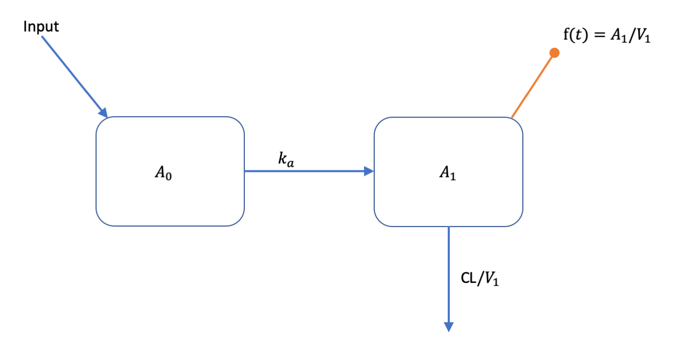
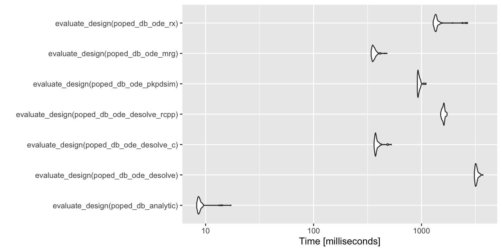

```{r setup, include = FALSE}
set.seed(1234)

if(Sys.getenv("LOGNAME")=="ancho179") devtools::load_all("~/Documents/_PROJECTS/PopED/repo/PopED/")
#devtools::install_github("InsightRX/PKPDsim",force = F)
# devtools::install_github("metrumresearchgroup/mrgsolve",force = F)
library(knitr)
library("kableExtra")

knitr::opts_chunk$set(
  collapse = TRUE
  , comment = "#>"
  #, fig.width=6
  , cache = TRUE
  #,results="hold"
)
```


\newcommand{\vect}[1]{\boldsymbol{#1}}
\newcommand{\mat}[1]{\boldsymbol{#1}}

# Introduction

This is a simple example on how to couple PopED with external R based PKPD simulation tools.  Typically, these tools might be R packages that can simulate from ordinary differential equation (ODE) based models.  In this document you will see how to couple PopED to  models, defined with ODEs, implemented using:

* deSolve (with native R ODE models)
* deSolve (with compiled C ODE models)
* deSolve (with compiled C++ ODE models using Rcpp)
* PKPDsim
* mrgsolve
* rxode2


```{r packages}
library(PopED)
library(PKPDsim)
library(mrgsolve)
library(deSolve)
library(Rcpp)
library(rxode2)
```

<!-- For the future we will also show how to use -->

<!-- * PKPDmodels -->
<!-- * dMod -->

# The model

We will use a one-compartment with linear absorption population pharmacokinetic (PK) model as an example (see below). 


<!-- Figure \@ref(fig:1-comp-lin-abs)). -->
<!-- ```{r 1-comp-lin-abs, echo=FALSE, fig.cap="Graphical representation of a one-compartment model with linear absorption.",fig.align='center'} -->
<!-- knitr::include_graphics("model_def_other_pkgs_1-comp-lin-abs.png") -->
<!-- ``` -->




This model can be described with the following set of ODEs:

$$
  \begin{split}
  \frac{dA_{0}}{dt} &=  - k_{a} \cdot A_{0}\\
  \frac{dA_{1}}{dt} &=-(CL/V_1)\cdot A_1 + k_{a} \cdot A_{0} \\
  f(t) &= A_1/V_1
  \end{split}
$$

All compartment amounts are assumed to be zero at time zero ($\vect{A}[t=0]=0$). Inputs to the system 
come in tablet form and are added to the amount in $A_{0}$ according to 

$$
  \text{Input}(t,D,t_D) =
  \begin{cases}
   D, &\text{if} \quad t = t_D \\
   0, &\text{otherwise} 
  \end{cases}
$$ 

Parameter values are defined as:

$$
  \begin{split}
    k_a &= \theta_{k_a} \cdot e^{\eta_{k_a}} \\
    CL &= \theta_{CL} \cdot e^{\eta_{CL}} \\
    V_1 &= \theta_{V_1} \cdot e^{\eta_{V_1}}  \\
  \end{split}
$$
where elements of the between subject variability (BSV),  $\eta_{j}$, vary across individuals and come from normal distributions with means of zero and variances of $\omega^2_{j}$.

The residual unexplained variability  (RUV) model has a  proportional and additive component

$$
  y = f(t) \cdot (1+\varepsilon_{prop}) + \varepsilon_{add}
$$

elements of  $\vect{\varepsilon}_{j}$ vary accross observations and come from 
normal distributions with means of zero and variances of $\sigma^2_{j}$.

Parameter values are assumed to be the following:
<!-- those in Table  \@ref(tab:values).   -->
```{r values,echo=FALSE}
dat <- tibble::tibble(
    "Parameter"=c("$k_a$","CL","$V_1$"
                  ,"$\\omega^2_{k_a}$"
                  ,"$\\omega^2_{CL}$","$\\omega^2_{V_1}$",
                  "$\\sigma^2_{prop}$","$\\sigma^2_{add}$"
    ),
    "Value"=c(0.25,3.75,72.8,
              0.09,0.0625,0.09,0.04,0.0025))
kable(dat,
  booktabs = TRUE,
  #caption = 'Model parameter values.',
  escape = FALSE,
  digits = 4,
) %>%  kableExtra::kable_styling("striped",full_width = F,position = "center") 

```


# Model implementation

Below we implement this model using a number of different methods.  For the ODE solvers, if possible, we set the tuning parameters to be the same values (`atol`, `rtol`, etc.).

## Analytic solution
First we implement an analytic solution to the model in a function that could be used in `PopED`. Here we assume a single dose or multiple dosing with a dose interval of `TAU` time units. The named vector `parameters` defines the values of  `KA`, `CL`, `V`, `DOSE` and `TAU` used to compute the value of `f` at each time point in the vector `xt`.

```{r structural_model_poped}
ff_analytic <- function(model_switch,xt,parameters,poped.db){
  with(as.list(parameters),{
    y=xt
    N = floor(xt/TAU)+1
    f=(DOSE/V)*(KA/(KA - CL/V)) * 
      (exp(-CL/V * (xt - (N - 1) * TAU)) * (1 - exp(-N * CL/V * TAU))/(1 - exp(-CL/V * TAU)) - 
         exp(-KA * (xt - (N - 1) * TAU)) * (1 - exp(-N * KA * TAU))/(1 - exp(-KA * TAU)))  
    return(list( f=f,poped.db=poped.db))
  })
}
```


## ODE solution using deSolve
The same model can be implemented using ODEs. Here the ODEs are defined in deSolve: 
```{r ode_desolve}
PK_1_comp_oral_ode <- function(Time, State, Pars){
  with(as.list(c(State, Pars)), {    
    dA1 <- -KA*A1
    dA2 <- KA*A1 - (CL/V)*A2
    return(list(c(dA1, dA2)))
  })
}
```


Then, just as in the analytic solution, the named vector `parameters` defines the values of  `KA`, `CL`, `V`, `DOSE` and `TAU` used to compute the value of `f` at each time point in the vector `xt`. The inputs to the system (dosing amounts and times) need to be added as `events` in the deSolve ODE solver called `deSolve::ode()`.  

```{r}
ff_ode_desolve <- function(model_switch, xt, parameters, poped.db){
  with(as.list(parameters),{
    A_ini <- c(A1=0, A2=0)
    
    #Set up time points for the ODE
    times_xt <- drop(xt)
    times <- c(0,times_xt) ## add extra time for start of the experiment
    dose_times = seq(from=0,to=max(times_xt),by=TAU)
    times <- c(times,dose_times)
    times <- sort(times) 
    times <- unique(times) # remove duplicates
    
    eventdat <- data.frame(var = c("A1"), 
                           time = dose_times,
                           value = c(DOSE), method = c("add"))
    
    out <- deSolve::ode(A_ini, times, PK_1_comp_oral_ode, parameters, 
                        events = list(data = eventdat),
                        atol=1e-8, rtol=1e-8,maxsteps=5000)
    
    # grab timepoint values
    out = out[match(times_xt,out[,"time"]),]
    
    f = out[,"A2"]/V
    
    f=cbind(f) # must be a column matrix 
    return(list(f=f,poped.db=poped.db))
  })
}
```

## ODE solution using deSolve and compiled C code
We can use compiled C code with deSolve to speed up computing solutions to the ODEs. The C code is written in a separate file is that needs to be compiled and looks like this: 
```{r,comment='',echo=FALSE}
cat(readChar(system.file("examples/one_comp_oral_CL.c", package="PopED"), 1e5))
```

This code is available as a file in the PopED distribution, and is compiled with the following commands:
```{r}
file.copy(system.file("examples/one_comp_oral_CL.c", package="PopED"),"./one_comp_oral_CL.c")
system('R CMD SHLIB one_comp_oral_CL.c')
dyn.load(paste("one_comp_oral_CL", .Platform$dynlib.ext, sep = ""))
```

The function used to compute the value of `f` at each time point in the vector `xt`, given the inputs to the system (dosing amounts and times), needs to be changed slightly, updating the arguments to `deSolve::ode()`.  

```{r}
ff_ode_desolve_c <- function(model_switch, xt, parameters, poped.db){
  with(as.list(parameters),{
    A_ini <- c(A1=0, A2=0)
    
    #Set up time points for the ODE
    times_xt <- drop(xt)
    times <- c(0,times_xt) ## add extra time for the start of the experiment
    dose_times = seq(from=0,to=max(times_xt),by=TAU)
    times <- c(times,dose_times)
    times <- sort(times) 
    times <- unique(times) # remove duplicates
    
    eventdat <- data.frame(var = c("A1"), 
                           time = dose_times,
                           value = c(DOSE), method = c("add"))
    
    out <- deSolve::ode(A_ini, times, func = "derivs", 
                        parms = c(CL,V,KA), 
                        dllname = "one_comp_oral_CL",
                        initfunc = "initmod", nout = 1, 
                        outnames = "Sum",
                        events = list(data = eventdat),
                        atol=1e-8, rtol=1e-8,maxsteps=5000)
    
    # grab timepoint values
    out = out[match(times_xt,out[,"time"]),]
    
    f = out[, "A2"]/V
    
    f=cbind(f) # must be a column matrix 
    return(list(f=f,poped.db=poped.db))
  })
}

```

## ODE solution using deSolve and compiled C++ code (via  Rcpp)

Here we define the ODE system using inline C++ code that is compiled via Rcpp

```{r}
cppFunction('List one_comp_oral_rcpp(double Time, NumericVector A, NumericVector Pars) {
int n = A.size();
NumericVector dA(n);

double CL = Pars[0];
double V = Pars[1];
double KA = Pars[2];

dA[0] = -KA*A[0];
dA[1] = KA*A[0] - (CL/V)*A[1];
return List::create(dA);
}')
```

Again, the arguments to `deSolve::ode()` need to be updated:  

```{r}
ff_ode_desolve_rcpp <- function(model_switch, xt, p, poped.db){
    A_ini <- c(A1=0, A2=0)
    
    #Set up time points for the ODE
    times_xt <- drop(xt)
    times <- c(0,times_xt) ## add extra time for start of integration
    dose_times = seq(from=0,to=max(times_xt),by=p[["TAU"]])
    times <- c(times,dose_times)
    times <- sort(times) 
    times <- unique(times) # remove duplicates
    
    eventdat <- data.frame(var = c("A1"), 
                           time = dose_times,
                           value = c(p[["DOSE"]]), method = c("add"))
    
    out <- deSolve::ode(A_ini, times, 
                        one_comp_oral_rcpp, 
                        c(CL=p[["CL"]],V=p[["V"]], KA=p[["KA"]]), 
                        events = list(data = eventdat),
                        atol=1e-8, rtol=1e-8,maxsteps=5000)
    
    
    # grab timepoint values for central comp
    f = out[match(times_xt,out[,"time"]),"A2",drop=F]/p[["V"]]
    
    return(list(f=f,poped.db=poped.db))
}
```


## ODE solution using PKPDsim

We can use PKPDsim to describe this set of ODEs. We then adjust the function used to compute the value of `f` at each time point in the vector `xt`, given the inputs to the system (dosing amounts and times), using the ODE solver `PKPDsim::sim_core()`.  
```{r}
pk1cmtoral <- PKPDsim::new_ode_model("pk_1cmt_oral") # take from library
ff_ode_pkpdsim <- function(model_switch, xt, p, poped.db){
    #Set up time points for the ODE
    times_xt <- drop(xt)  
    dose_times <- seq(from=0,to=max(times_xt),by=p[["TAU"]])
    times <- sort(unique(c(0,times_xt,dose_times)))

    N = length(dose_times)
    regimen = PKPDsim::new_regimen(amt=p[["DOSE"]],n=N,interval=p[["TAU"]])
    design <- PKPDsim::sim(
      ode = pk1cmtoral, 
      parameters = c(CL=p[["CL"]],V=p[["V"]],KA=p[["KA"]]), 
      regimen = regimen,
      only_obs = TRUE,
      t_obs = times,
      checks = FALSE,
      return_design = TRUE)
    tmp <- PKPDsim::sim_core(sim_object = design, ode = pk1cmtoral)
    f <- tmp$y
    m_tmp <- match(round(times_xt,digits = 6),tmp[,"t"])
    if(any(is.na(m_tmp))){
      stop("can't find time points in solution\n", 
           "try changing the digits argument in the match function")
    } 
    
    f <- f[m_tmp]
    return(list(f = f, poped.db = poped.db))
}
```


## ODE solution using mrgsolve

We can also use mrgsolve to describe this set of ODEs.   
```{r mrgcode}
code <- '
$PARAM CL=3.75, V=72.8, KA=0.25
$CMT DEPOT CENT
$ODE
dxdt_DEPOT = -KA*DEPOT;
dxdt_CENT = KA*DEPOT - (CL/V)*CENT;
$TABLE double CP  = CENT/V;
$CAPTURE CP
'
```

We then compile and load the model with `mcode`
```{r}
moda <- mrgsolve::mcode("optim", code, atol=1e-8, rtol=1e-8,maxsteps=5000)
```

Finally, we adjust the function used to compute the value of `f` at each time point in the vector `xt`, given the inputs to the system (dosing amounts and times), using the ODE solver `mrgsolve::mrgsim_q()`.

```{r}
ff_ode_mrg <- function(model_switch, xt, p, poped.db){
  times_xt <- drop(xt)  
  dose_times <- seq(from=0,to=max(times_xt),by=p[["TAU"]])
  time <- sort(unique(c(0,times_xt,dose_times)))
  is.dose <- time %in% dose_times
  
  data <- 
    tibble::tibble(ID = 1,
                      time = time,
                      amt = ifelse(is.dose,p[["DOSE"]], 0), 
                      cmt = ifelse(is.dose, 1, 0), 
                      evid = cmt,
                      CL = p[["CL"]], V = p[["V"]], KA = p[["KA"]])
  
  out <- mrgsolve::mrgsim_q(moda, data=data)
  
  f <-  out$CP
  
  f <- f[match(times_xt,out$time)]
  
  return(list(f=matrix(f,ncol=1),poped.db=poped.db))
  
}
```

## ODE solution using rxode2

We can use rxode2 to describe this set of ODEs.   

```{r}
modrx <- rxode2::rxode2({
  d/dt(DEPOT) = -KA*DEPOT;
  d/dt(CENT) = KA*DEPOT - (CL/V)*CENT;
  CP=CENT/V;
})
```

We adjust the function used to compute the value of `f` at each time point in the vector `xt`, given the inputs to the system (dosing amounts and times), using the ODE solver `rxode2::rxSolve()`.

```{r}
ff_ode_rx <- function(model_switch, xt, p, poped.db){
  times_xt <- drop(xt)
  et(0,amt=p[["DOSE"]], ii=p[["TAU"]], until=max(times_xt)) %>%
    et(times_xt) -> data
  
  out <- rxode2::rxSolve(modrx, p, data, atol=1e-8, rtol=1e-8,maxsteps=5000,
                 returnType="data.frame")
  
  f <-  out$CP[match(times_xt,out$time)]
  
  return(list(f=matrix(f,ncol=1),poped.db=poped.db))
  
}
```

## Common model elements

Other functions are used to define BSV and RUV.

```{r}

sfg <- function(x,a,bpop,b,bocc){
  parameters=c( 
    KA=bpop[1]*exp(b[1]),
    CL=bpop[2]*exp(b[2]),
    V=bpop[3]*exp(b[3]),
    DOSE=a[1],
    TAU=a[2])
  return( parameters ) 
}

feps <- function(model_switch,xt,parameters,epsi,poped.db){
  f <- do.call(poped.db$model$ff_pointer,list(model_switch,xt,parameters,poped.db))[[1]]
  y = f*(1+epsi[,1])+epsi[,2]
  return(list(y=y,poped.db=poped.db)) 
}
```

# Create PopED databases
Next we define the model to use, the parameters of those models, the intial design design and design space for any design calculation.  Here we create a number of databases that correspond to different model implementations.

The initial design is a 2 group design, with doses of 20 mg or 40 mg every 24 hours.  Each group has the same sampling schedule, with 3 samples in the first day of the study and 2 on the 10th day of the study.  

```{r}
poped_db_analytic <- create.poped.database(
  ff_fun =ff_analytic,
  fg_fun =sfg,
  fError_fun=feps,
  bpop=c(KA=0.25,CL=3.75,V=72.8), 
  d=c(KA=0.09,CL=0.25^2,V=0.09), 
  sigma=c(prop=0.04,add=0.0025),
  m=2,
  groupsize=20,
  xt=c( 1,2,8,240,245),
  minxt=c(0,0,0,240,240),
  maxxt=c(10,10,10,248,248),
  bUseGrouped_xt=1,
  a=cbind(DOSE=c(20,40),TAU=c(24,24)),
  maxa=c(DOSE=200,TAU=24),
  mina=c(DOSE=0,TAU=24))


poped_db_ode_desolve <- create.poped.database(poped_db_analytic,ff_fun = ff_ode_desolve)
poped_db_ode_desolve_c <- create.poped.database(poped_db_analytic,ff_fun = ff_ode_desolve_c)
poped_db_ode_desolve_rcpp <- create.poped.database(poped_db_analytic,ff_fun = ff_ode_desolve_rcpp)
poped_db_ode_pkpdsim <- create.poped.database(poped_db_analytic,ff_fun = ff_ode_pkpdsim)
poped_db_ode_mrg <- create.poped.database(poped_db_analytic,ff_fun = ff_ode_mrg)
poped_db_ode_rx <- create.poped.database(poped_db_analytic,ff_fun = ff_ode_rx)
```

# Model predictions

So are there difference in the model predictions between the different implementations?

Here is a visual representation of the model predictions for this study design, based on the analytic solution:
```{r}
plot_model_prediction(poped_db_analytic,model_num_points = 500,PI=T,separate.groups = T) 
```

We can compare the different predictions in this plot accross model implementations.  Here we see that the accuracy of the different methods are within machine precision (or very small).
```{r}
pred_std <- model_prediction(poped_db_analytic,model_num_points = 500,include_sample_times = TRUE,PI = TRUE)

pred_ode_desolve <- model_prediction(poped_db_ode_desolve,
                                     model_num_points = 500,
                                     include_sample_times = TRUE,
                                     PI = TRUE)
all.equal(pred_std,pred_ode_desolve)

pred_ode_desolve_c <- model_prediction(poped_db_ode_desolve_c,
                                       model_num_points = 500,
                                       include_sample_times = TRUE,
                                       PI = TRUE)
all.equal(pred_std,pred_ode_desolve_c)

pred_ode_desolve_rcpp <- model_prediction(poped_db_ode_desolve_rcpp,
                                          model_num_points = 500,
                                          include_sample_times = TRUE,
                                          PI = TRUE)
all.equal(pred_std,pred_ode_desolve_rcpp)

pred_ode_pkpdsim <- model_prediction(poped_db_ode_pkpdsim,
                                     model_num_points = 500,
                                     include_sample_times = TRUE,
                                     PI = TRUE)
all.equal(pred_std,pred_ode_pkpdsim)

pred_ode_mrg <- model_prediction(poped_db_ode_mrg,
                                 model_num_points = 500,
                                 include_sample_times = TRUE,
                                 PI = TRUE)
all.equal(pred_std,pred_ode_mrg)

pred_ode_rx <- model_prediction(poped_db_ode_rx,
                                 model_num_points = 500,
                                 include_sample_times = TRUE,
                                 PI = TRUE)
all.equal(pred_std,pred_ode_rx)

```

# Evaluate the design

Here we compare the computation of the Fisher Information Matrix (FIM). By comparing the $ln(det(FIM))$ (the lnD-objective function value, or ofv). 

```{r}
(eval_std <- evaluate_design(poped_db_analytic))
```


All the computations give very similar results:
```{r}
eval_ode_desolve <- evaluate_design(poped_db_ode_desolve) 
all.equal(eval_std$ofv,eval_ode_desolve$ofv)

eval_ode_desolve_c <- evaluate_design(poped_db_ode_desolve_c) 
all.equal(eval_std$ofv,eval_ode_desolve_c$ofv)

eval_ode_desolve_rccp <- evaluate_design(poped_db_ode_desolve_rcpp) 
all.equal(eval_std$ofv,eval_ode_desolve_rccp$ofv)

eval_ode_pkpdsim <- evaluate_design(poped_db_ode_pkpdsim) 
all.equal(eval_std$ofv,eval_ode_pkpdsim$ofv)

eval_ode_mrg <- evaluate_design(poped_db_ode_mrg) 
all.equal(eval_std$ofv,eval_ode_mrg$ofv)
```


# Speed of FIM computation

We can compare the speed of the computations.  Analytic solutions are fast, as expected, in this case more than 20 times faster than any of the ODE methods. mrgsolve is the fastest of the ODE solvers in this example. Note that much of the speed difference between mrgsolve, RxODE and PKPDsim has been found to be due to the overhead from pre- and post-processing of the simulation from ODE systems.  Other ways of handling the pre- and post-processing may speed up these computations.

```{r timing, eval=FALSE}
library(microbenchmark)
library(ggplot2)

compare <- microbenchmark(
  evaluate_design(poped_db_analytic),
  evaluate_design(poped_db_ode_desolve),
  evaluate_design(poped_db_ode_desolve_c),
  evaluate_design(poped_db_ode_desolve_rcpp),
  evaluate_design(poped_db_ode_pkpdsim),
  evaluate_design(poped_db_ode_mrg),
  evaluate_design(poped_db_ode_rx),
  times = 100L)

autoplot(compare)
```

```{r,echo=FALSE,results="hide", eval=FALSE}

if(interactive()) setwd(here::here("vignettes"))

rdata_name <- "model_def_other_pkgs_compare_speed"
obj_list <- c("compare")

if(knitr::opts_chunk$get("run_compare")){
  save(list = obj_list,file = paste0(rdata_name,".RData"))
} else {
  load(file = paste0(rdata_name,".RData"))
}

png("model_def_other_pkgs_compare_speed.png", 
    width = 8, height = 4, units = 'in', 
    res = 200)
autoplot(compare)
dev.off()

compare.db <- print(compare)

```

```{r,echo=FALSE, eval=FALSE}
kable(
  compare.db,
  booktabs = TRUE,
  caption = 'Speed of design evaluation computations in milliseconds.'
  #,escape = FALSE
) %>%  kable_styling("striped",full_width = F) 
```




# Version information {-}

```{r session, cache.rebuild=TRUE}
devtools::session_info()
#sessionInfo()
```

<!-- `r if (knitr::is_html_output()) '# References {-}'` -->
